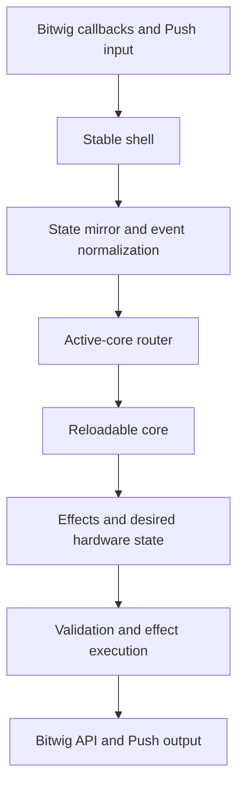
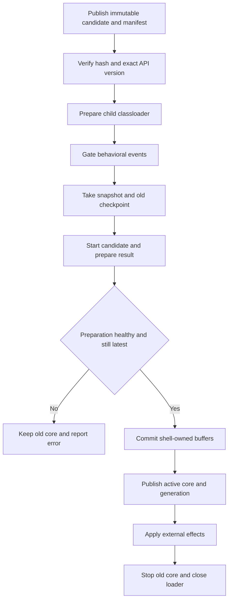

# Reloadable Controller Core

Status: Milestones 1 through 4 and the Core API 6 selected-track parameter bridge are implemented
and pass offline verification. The drum-fill shell now uses a single-active replacement barrier;
the Core-API-6 shell on Bitwig controller API 21 and Drum Pitch session contract still require
their live Bitwig/Push checkpoint.

Primary goal: make ordinary controller development possible without restarting Bitwig.

## Outcome

Pull's runtime split and development tool are separate Maven modules:

```text
pull-core-api   Stable parent-loaded interfaces and immutable messages
pull-core       Child-loaded controller behavior
pull-core-bundle   Resource-only build edge that nests the current core JAR
pull-core-publisher   Development-only immutable publication/status tool
pull-shell      Bitwig extension, subscriptions, MIDI/USB, and effect execution
```

Bitwig loads `pull-shell` normally. The shell creates one child classloader for the active
`pull-core` JAR. During development it can discard that core and load a new JAR while keeping
Bitwig, its API objects, MIDI ports, note input, and the Push USB connection alive.

A new classloader gives the replacement core fresh class definitions. Core changes may add or
remove classes, fields, methods, packages, and compartment-safe pure-Java dependencies without
using JVMTI class redefinition or restarting Bitwig.

The governing rule is:

> The shell owns resources and side effects. The core receives immutable state and events and
> returns immutable effects and desired hardware output.

## Priorities

1. Eliminate Bitwig restarts for normal behavior, mapping, mode, and rendering work.
2. Make the development command compile, publish, reload, and report the exact active build.
3. Make core behavior testable without Bitwig through fake snapshots and effect assertions.
4. Add record/replay for real Bitwig sessions after the first vertical slice works.

Testing is enabled by the same boundary; it is not a separate mock of the entire Bitwig API.

## Non-goals

- Rust, JNI, subprocesses, or IPC.
- Dynamically replacing the Bitwig shell.
- Exposing Bitwig remote objects to the core.
- Child-loading the current callback-heavy object graph unchanged.
- Registering core-owned observers, commands, light suppliers, threads, or raw `Runnable`s.
- Guaranteeing zero restarts for extension metadata, ports, USB discovery, settings schema, or
  Bitwig state the shell never subscribed to.

## Delivery sequence

These are implementation milestones. Milestones 1 through 3 are preserved as one testable
checkpoint; milestone 4 is a separate branch/checkpoint so either stage can be installed and tested
independently.

### Milestone 1: Mechanical Maven split

- Convert the repository root into a parent reactor.
- Move all existing behavior unchanged into `pull-shell`.
- Create empty `pull-core-api` and `pull-core` JAR modules.
- Preserve `de.mossgrabers:Pull`, `target/Pull.bwextension`, and the release ZIP.
- Make `pull-shell` depend on `pull-core-api`.
- Make `pull-core` depend on `pull-core-api` as `provided`.
- Do not make `pull-shell` depend normally on `pull-core`.
- Prove the extension's functional archive contents are unchanged.

### Milestone 2: Core API and offline harness

- Add the minimal lifecycle API and immutable DTOs.
- Add fake snapshots, a fake effect executor, and deterministic clock support.
- Add a no-op/canary core with unit tests.
- Enforce that the core has no Bitwig or shell dependencies.

### Milestone 3: Transactional loader and fast development command

- Embed the production core JAR as a nested resource, never exploded classes.
- Add the child-first runtime classloader and `RuntimeManager`.
- Add a resource-only bundle so Maven orders core before shell without exposing core classes.
- Add atomic candidate publication, build IDs, status, failure fallback, and generation fencing.
- Fingerprint the complete parent-loaded shell/API input so installed-version drift requires a restart.
- Add the compile/publish/reload command and classloader fixture tests.
- Prove that core version B may add a class, field, and method over version A.

### Milestone 4: Drum-fill vertical slice

- Page across every scene on the selected track, publish an empty generation fence when topology
  changes, then expose only complete immutable catalogs.
- Permanently route the 12 otherwise-unused pads directly above Drum Pads' yellow rate controls.
- Match selected-track clips containing `fill` case-insensitively inside the core, keep scene
  order, and assign the first 12 one per pad.
- Back each control with a private startup-created one-slot actuator that arms asynchronously and
  freezes while it owns the session's single acquired lease.
- Keep one acquired fill lease above an opaque Bitwig-owned base. A later press becomes the latest
  value-only pending intent; return and retire the active fill before resolving and launching that
  replacement from the same base.
- Publish complete per-pad RGB state from authoritative shell read-back: dim orange ready, fully
  lit orange only for the active session owner, and off otherwise. Never infer success
  optimistically from a press request.
- Cover catalog scans, off-window edits, readiness, overlapping holds, reload hydration, exact
  delayed Return acknowledgements, releases, failures, and transaction ordering without Bitwig.

### Core API 6: generic selected-track parameter bridge

- Eagerly create one selected-track cursor and one filtered eight-slot remote-controls cursor in
  the stable shell; it observes tagged project pages rather than creating them.
- Publish a generation-fenced parameter catalog with authoritative normalized values.
- Normalize absolute hardware input as `AbsoluteInputEvent` and execute exact
  `SetParameterValueEffect` requests only against the matching catalog generation and slot identity.
- Let the core publish generic input ownership and normalized absolute hardware output, so the
  stable router never hard-codes the feature-specific remote name.
- Reserve the Drum Pitch ribbon in drum performance mode and fail closed when the exact global
  target is unavailable; raw pitch bend would affect only live-input voices and misrepresent the
  product behavior.

### Later milestones

- Install the bounded capability canopy described below for practical Push input and common DAW
  state/actions.
- Migrate drum behavior, then remaining mode/view families.
- Move display decisions and add golden output tests.
- Add event recording and offline replay.
- Retire JVMTI as the default development path.

## Current lifecycle

Bitwig discovers
[`Push2ControllerExtensionDefinition`](../pull-shell/src/main/java/de/mossgrabers/bitwig/controller/ableton/push/Push2ControllerExtensionDefinition.java),
which creates
[`PushControllerSetup`](../pull-shell/src/main/java/de/mossgrabers/controller/ableton/push/PushControllerSetup.java).
[`GenericControllerExtension`](../pull-shell/src/main/java/de/mossgrabers/bitwig/framework/extension/GenericControllerExtension.java)
delegates Bitwig's `init`, `flush`, and `exit` lifecycle to that setup.
[`ReloadableControllerSetup`](../pull-shell/src/main/java/de/mossgrabers/pull/shell/runtime/ReloadableControllerSetup.java)
now wraps those calls so the reload supervisor starts after legacy startup, drains candidates before
each legacy flush, and closes before the existing setup releases model/MIDI/USB resources.

[`AbstractControllerSetup.init()`](../pull-shell/src/main/java/de/mossgrabers/framework/controller/AbstractControllerSetup.java)
currently creates one connected graph containing settings, model banks, subscriptions, MIDI/USB,
modes, views, observers, commands, hardware bindings, and light suppliers. Concrete drum objects
are created once in `PushControllerSetup.createViews()`. Permanent pad bindings then call the
active concrete view through
[`AbstractControlSurface`](../pull-shell/src/main/java/de/mossgrabers/framework/controller/AbstractControlSurface.java).

Standard class redefinition can replace compatible method bodies, but it cannot reshape those
already-live objects or rerun their constructors. Re-registering the graph duplicates callbacks
and retains old objects. The target design inserts one permanent router before behavior.

## Target data flow



All arrows are ordinary in-process Java calls. There is no serialization or network transport.

## Milestone-4 vertical slice

The first migrated surface is the otherwise-unused 3x4 region immediately above the four yellow
rate controls while Drum Pads is active:

```text
64 65 66 67   fill candidates 9-12
56 57 58 59   fill candidates 5-8
48 49 50 51   fill candidates 1-4
40 41 42 43   existing yellow rate controls
```

The permanent surface router owns the 12 fill pads' down/up events. The existing drum translation
matrix maps all of them to `-1`, so they do not leak musical notes. The legacy 4x4 drum block, rate
controls, and Select + Repeat Bitwig transport fill mode are unchanged.

During extension initialization, before reloadable behavior runs, the shell creates one private
eight-scene scanner cursor and 12 private one-scene actuator cursors. The scanner follows the
framework-selected track, walks every scene in pages, and requires two coherent samples per page.
A selected-track or scene-count change immediately publishes an empty new-generation fence, so all
pads stay off while the replacement sweep converges; after that, only complete catalogs are
published. Eight is a throughput/page-size choice, not a project-size cap. Continuous sweeps make
edits outside the current Bitwig session view eventually visible. The core receives selected-track
clips in absolute scene order with names and opaque IDs—never Bitwig objects, banks, or indices.

The core filters names containing `fill` case-insensitively, keeps catalog order, takes at most 12,
and publishes a complete desired control-to-target binding map. Each actuator parks on its desired
track/scene and becomes armed only after two samples agree on track identity, pinned state, scene
index, clip name, existence, and content. The shell returns that separately as the verified armed
map. A pad
is actionable only when its exact desired target is already armed; a down during convergence is
ignored rather than queued for a surprise later launch.

Each pad has its own private actuator, but a fill session acquires at most one actuator at a time.
The session is an opaque Bitwig-owned base plus one optional active fill lease and one optional
value-only pending intent. The base is the launcher clip or Arrangement playback that Bitwig owned
before the gesture; the controller API does not expose one durable identity covering both forms, so
the shell deliberately does not guess it. A pending intent contains only owner, catalog generation,
target ID, and launch policy. It owns no Bitwig proxy, never appears as the active owner, and is not
included in session read-back.

A ready press from the base prepares and launches that exact target. While a fill is active, a
later press replaces the pending intent—latest press wins—but does not prepare or launch the
replacement yet. The handoff observes the active fill busy, submits its native `Return`, waits for
a later non-busy sample, retires the exact actuator, waits one further host sample, revalidates the
pending generation and armed binding, and only then prepares and launches the replacement. Bitwig
does not expose the Return anchor: the non-busy sample proves only that the released target stopped,
and the extra sample is the strongest available opaque-base barrier rather than direct proof of
which launcher clip or Arrangement source resumed. This serialization prevents the replacement's
ALT release destination from becoming the previous fill in the observed native behavior. A newer
press may replace the pending intent; releasing that pending owner cancels it. Releasing the
eventual replacement later uses its own native `Return`; no older controller-held fill lease is
retained beneath it.

Raw MIDI note-off is observed below the command layer, so switching views cannot consume the only
release. Bitwig's void launch calls are command submissions, not acknowledgements. The active
actuator remains frozen while `isPlaying`, `isPlaybackQueued`, and `isStopQueued` provide
authoritative progress. A stale false value before the launch has ever been observed busy cannot
acknowledge an early Return. A failed Return keeps the exact active lease and latest pending intent
owned for retry; no replacement proxy is reserved across that wait. A down rejected while unarmed,
or a deferred target whose catalog generation/binding changes before launch, is discarded rather
than launched later by surprise.

Core API 6 carries the host-independent launch policy and the generic parameter messages.
Capability `effect.clip-launch-hold` version 4 defines the single-active session and latest-pending
handoff; `snapshot.clip-launch-session` version 1 reports a map containing at most the one acquired
owner-to-target lease plus its authoritative active owner. There are no hidden fills or held-pad
fallback. The shell freezes the launch policy into the acquired lease and maps it to Bitwig
API 21. The current fill policy launches with quantization `Immediate` and mode `Legato from Clip
(or Project)`, then invokes the fill clip's ALT release lane. Entry therefore ignores the source and
fill clips' configured launch quantization and mode. Bitwig's API cannot name a release action
directly, so the effective ALT release action on each fill must resolve to `Return`; with the clip
on `Use Project Setting`, this is the project's default ALT Release setting. Clip looping and
length remain session content.

Physical held state, desired/armed bindings, the acquired lease, latest pending intent, opaque base
token, and authoritative active owner live in the shell across a hot core reload. Starting a
replacement core hydrates current held, armed, parameter, and acquired-session read-back but
deliberately synthesizes no press. The core renders fully lit orange only after Bitwig reports the
acquired owner playing; neither the input nor pending intent is optimistic feedback.
Snapshot-change delivery remains pending until a core accepts it, so an intervening input or
rejected render cannot permanently lose read-back. Requested, queued, playing, release-requested,
retired, base-barrier, and pending are distinct states.

Structural scene insertion/reordering during a hold remains an inherent limitation of Bitwig's
paged slot proxies, which expose no durable clip ID, but the pinned track and frozen scene proxy are
the narrowest supported identity. Whole-extension disable/exit is also different from hot core
reload: API 21 gives `exit()` no asynchronous grace/completion contract, so shutdown can submit one
best-effort Return for the single acquired fill but cannot wait for confirmation. `scheduleTask()`
is not a safe substitute after exit.

### Generic selected-track parameter bridge

Core API 6 adds a reusable, host-independent parameter seam. During extension initialization the
shell eagerly creates one selected-track cursor shared by two bounded parameter hosts. The generic
host owns one `CursorRemoteControlsPage` with eight slots. The first constructor string names the
API cursor; it does not create or rename project content. A Bitwig project may contain a page
uniquely named exactly `Pull` and tagged `pull`; the shell filters existing pages by that tag,
follows the selected track, and selects that unique page. Missing, duplicate, pinned, partially
populated, or structurally changing pages are unavailable until two consecutive complete samples
agree. The exact `Pull` / `Drum Pitch` remote identity is reserved and suppressed from this generic
host because the managed helper below owns it.

The second host owns a one-slot logical Drum Pitch target backed by native device proxies. A
composite preserves generic target IDs `0..7`, assigns the managed target ID `8`, requires both
children to report the same selected-track identity, and owns the combined catalog generation.
This keeps the core's parameter DTO/effect contract generic while preventing an old session Macro
from becoming an ambiguous or accidental pitch target.

The snapshot publishes an ordered `ParameterCatalogSnapshot` containing opaque slot
`ParameterTargetId`s, page and parameter names, and normalized values read from Bitwig. Any change
to selected-track identity, remote page identity, remote slot identity, or managed-helper structure
advances the catalog generation. `AbsoluteInputEvent` carries normalized hardware values without
Bitwig types.
`SetParameterValueEffect` names one exact target and generation; before calling
`setImmediately()`, the shell re-samples and verifies the track, page, slot name, existence, and
generation. A successful write is still only a command. Snapshot values, ribbon LEDs, displays,
and all other feedback change only after the subscribed remote parameter reports the host value.
The core separately publishes a complete claimed-input set and normalized absolute hardware-output
map. The stable shell routes and renders those logical controls without knowing which parameter
name or behavior caused the claim.

### Drum Pitch session contract

The first consumer is the drum-view Push ribbon. The managed host scans the selected track for the
first top-level Drum Machine and up to 16 top-level Bend Note FX devices. The shell bundles a
neutral preset named exactly `Pull Drum Pitch Helper v1`, created by `DrivenByMoss Pull`, publishes
it with an integrity check to a stable file, and inserts that file immediately before the Drum
Machine through `beforeDeviceInsertionPoint().insertFile()`. The preset is neutral at insertion, so asynchronous
read-back cannot leave Bitwig playing through Bend's non-neutral factory `-2 st` state.

Ownership requires the Bend UUID plus the exact subscribed preset name and creator. The
shell never adopts or mutates an arbitrary user device. Exactly one branded helper anywhere before
the first Drum Machine is valid, so adding another Note FX between them does not create a duplicate.
A branded helper after the Drum Machine, duplicate branded helpers, a full 16-device scan without a
helper, overflow, missing parameters, unsettled selected-track topology, selected-track
disagreement, and unsupported nested Drum Machines all fail closed. A short generation-checked
settling window after each cursor retarget prevents cached empty device-bank values from authorizing
an insertion. In-flight insertions are tracked by track identity across A→B→A selection changes,
and only observing the branded helper on that same track acknowledges the command. After two
unacknowledged attempts, the target withdraws and the shell logs one actionable warning instead of
continuing to claim a control it can no longer service.

The host also subscribes to the helper's enabled state and complete semantic configuration. A
branded helper is not ready until `DELAY_ON`, delay/duration modes and times, curve, and offset match
the canonical preset. Drift repair disables an enabled helper first, restores all semantic settings,
and re-enables it only after subscribed read-back confirms the configuration. Insertion,
configuration repair, and pitch writes are commands, not acknowledgements; recoverable failures are
reported without optimistic state changes.

Bend's `CONTENTS/SEMITONES` parameter exposes its physical normalized ±48-semitone range through the
generic shell contract. The reloadable core maps the ribbon's `0..1` range to `0.375..0.625`, making
the musical ±12-semitone window reloadable policy. Bend preserves the drum-pad note key and starts
each new note at the requested offset. The managed configuration holds that offset for two seconds,
then returns to the note's defined pitch over two seconds. This finite behavior is intentional for
the stated drum-hit use case; already-sounding long voices and independent preservation of authored
clip bend are not promised.

Installing the helper proxy canopy requires one extension copy and Bitwig restart. After that,
selected-track changes, helper insertion/recreation, marker strings, filtering, ordering,
truncation, colors, active-fill policy, Drum Pitch core policy, and behaviors composed from the
existing catalog/events/effects do not require another restart. A Bitwig property, device type,
parameter ID, or operation outside the installed bridge still requires a shell change and restart.

## Stable shell responsibilities

The shell owns anything coupled to Bitwig or physical hardware:

- extension UUID, metadata, port counts, discovery, and USB matchers;
- `ControllerHost`, setup factory, settings UI, and concrete `com.bitwig.*` adapters;
- model/cursor/bank creation, interested properties, and observers;
- Bitwig preferences and document-setting registration;
- MIDI input/output, SysEx, note translation, and the low-latency note path;
- Push inquiry, sensitivity, ribbon, palette, and hardware bootstrap;
- USB display ownership, buffers, queues, and shutdown;
- one permanent binding for every migrated Push control and light;
- canonical Bitwig snapshot and pressed/touched-control state;
- timer scheduling, generation fencing, and effect execution;
- classloading, reload status, logging, and safe fallback.

The shell may reuse the existing `ModelImpl` and Bitwig wrapper graph internally. That graph must
not cross into the core.

## Capability-canopy next milestone

The next shell milestone should install a deliberately broad but finite capability canopy during
extension initialization. Its purpose is to make most foreseeable behavior changes core-only even
when no current feature consumes every subscription. The shell should eagerly create the permanent
routers, proxies, interested properties, and observers for:

- all practical Push inputs: grid/button press and release, encoder turns and touch, ribbon values
  and touch, pad pressure where supported, and pedal input;
- common transport state and actions, including play/stop, record, loop, metronome, tempo/position,
  and other explicitly selected transport commands;
- common selected-track identity and mixer state;
- bounded selected-track clip windows plus a bounded pool of launch, stop, and selection actuators;
- selected-device identity, navigation, page identity, and bounded parameter windows;
- bounded tagged-remote pages, beginning with the eight-slot `Pull` page; and
- generic generation-fenced parameter set, touch, and increment effects, along with typed clip and
  transport effects.

This is a capability canopy, not a mirror of the entire project. Bitwig cursor/bank/proxy topology
is owned by extension initialization, each bank and actuator pool has finite capacity, and a project
can contain unbounded tracks, scenes, devices, layers, and parameters. Eagerly creating every
possible proxy is neither supported nor responsible. Each installed domain must therefore document
its exact capacity, selection/following scope, identity and generation rules, and any required
session names, tags, mappings, or devices. Scanners may expose changing windows of a larger project,
but scanning does not make arbitrary off-window state directly addressable.

Once installed, new mappings, modes, gestures, and UI composed only from this canopy can ship by
core reload. A future feature that needs state, capacity, identity, or an action outside the finite
canopy still requires a parent-loaded API/shell change, extension installation, and Bitwig restart.

## Reloadable core responsibilities

The core owns behavior that should be cheap to change:

- logical modes and views;
- mappings and gesture state machines;
- drum behavior and fill matching;
- configuration interpretation;
- navigation and selection policy;
- display layout decisions;
- desired pad, button, ribbon, and display state;
- feature-specific helpers and safe pure-Java dependencies.

Existing modes/views cannot simply be moved. Many register observers or scheduled lambdas into
parent-owned collections with no removal path. Each feature must first be converted to stable
events and effects.

## Boundary rules

1. No `com.bitwig.*` type crosses into the core.
2. Do not pass `IModel`, `PushControlSurface`, `IHost`, `IView`, `IMode`, or `Configuration`.
3. Only core-API types, JDK value types, and defensively copied primitive data cross.
4. The core registers no observers, callbacks, commands, lights, or shutdown hooks.
5. The core creates no threads or executors.
6. Timers are requested as effects and returned as generation-tagged events.
7. The core performs no Bitwig calls; it returns effects.
8. Core handlers are synchronous, bounded, and contain no I/O or sleeps.
9. No child object, exception, lambda, reflection object, or classloader is cached by the shell.
10. Core dependencies must be pure Java and safe to discard with the classloader.

Build checks must reject core imports of Bitwig/shell packages, a core dependency on the shell,
duplicate API classes in the core JAR, and exploded core implementation classes in the extension.

## Initial API shape

```java
public interface CoreProvider
{
    CoreDescriptor descriptor ();

    ControllerCore create ();
}

public interface ControllerCore
{
    CoreResult start (ControllerSnapshot snapshot, Optional<StateEnvelope> previousState);

    CoreResult handle (CoreEvent event, ControllerSnapshot snapshot);

    StateEnvelope checkpoint ();

    void stop ();
}
```

The descriptor includes the exact API version, build ID, state schema, and required shell
capabilities. The state envelope is opaque bytes owned by the core; Java object serialization is
forbidden. If it is absent or incompatible, the new core starts from the authoritative shell
snapshot.

## Snapshot and effects

The snapshot currently contains revision, monotonic time, shell capabilities, the complete
selected-track clip catalog, the generation-fenced eight-slot selected-track parameter catalog,
verified per-control armed clip bindings, the clip-launch session's optional acquired
owner-to-target lease and authoritative active owner, and pressed/touched controls. A pending fill
intent is shell-private and never appears active in this read-back. Add each new domain as a typed
API value when its first migrated vertical slice needs it. The eventual stable snapshot is expected
to cover:

- revision and shell capabilities;
- transport;
- selected-track clip catalog and other visible track/scene windows;
- selected track/device and parameter page;
- drum/note context;
- configuration values;
- active shell-owned sessions;
- pressed/touched controls;
- separate generations for mutable Bitwig bank windows.

Bitwig bank indices are not durable identities. Before executing a scroll, the shell increments
that bank's generation and marks it pending. Location-targeted effects from the prior generation
are immediately rejected. The new window is published only after Bitwig's observed membership
stabilizes.

Core API 6 includes logical timer effects, persistent desired clip bindings, verified armed
bindings, the version-1 authoritative single-lease clip-launch-session snapshot,
generation-fenced version-4 acquire/replace/release effects, `AbsoluteInputEvent`, the selected-track
parameter catalog, `SetParameterValueEffect`, complete input ownership, and desired RGB plus
normalized absolute hardware state. Later typed
effects will cover scene launch, selection, bank scrolling, generic parameter touch and increment,
transport/application actions, note mapping/repeat, approved MIDI/SysEx, notifications, and richer
desired hardware state.

Adding behavior composed from existing snapshot data and effects is a core-only change. Adding a
new state domain or executor is a shell-capability change.

## Transactional reload



Requirements:

- Candidate JARs have unique names and are never overwritten while loaded.
- API version is verified for every candidate; external candidates also verify their published
  SHA-256 before any core class is loaded.
- Only one candidate is prepared; newer builds supersede older request generations.
- Provider construction, checkpoint, startup, swap, and effect application are serialized on
  Bitwig's controller thread.
- Physical held-state is updated before gating and hydrated into the candidate.
- Real-time note forwarding remains active during the behavioral swap.
- Candidate output and effects are fully validated/resolved without mutation, committed as an
  in-memory buffer swap, and applied only after the active core pointer changes.
- A prepare/commit failure keeps the old core active. An external apply failure is logged after the
  new core is active and cannot roll the transaction back halfway through Bitwig calls.
- Any candidate failure leaves the old core running.
- Old `stop()` must be non-blocking and latency-instrumented.
- Old-generation timers, results, and stale bank effects are ignored.
- Once an output proxy is migrated, success forces its complete replay while bypassing render caches.
- Extension exit rejects new candidates, requests worker cancellation, waits for a bounded join,
  closes candidate/active loaders, and shuts model/MIDI/USB exactly once. If verification does not
  return before the join deadline, its finalizer performs deferred private-JAR cleanup.

## Classloading and packaging

`pull-core-api` is parent-loaded and contains only immutable contracts. `pull-core` depends on it
as `provided`. `pull-shell` contains the API but must not have the core implementation on its
ordinary runtime classpath.

`pull-core-bundle` has a build-time edge to `pull-core` and contains only the resolved core JAR as
`META-INF/pull/core/pull-core.jar`. `pull-shell` depends on that resource-only bundle, so Maven's
reactor orders core packaging before shell packaging without making core implementation classes a
transitive shell dependency. The bundle deletes its previous nested output before every copy, and
the shell deletes any legacy direct copy before packaging, so an incremental build cannot silently
reuse an old core. The shell extracts the nested resource before loading it.

The development loop publishes unique core JARs plus an atomic properties manifest under a stable
user directory that Bitwig does not purge. The full extension build also embeds
`META-INF/pull-shell.properties`, whose fingerprint covers the parent-loaded API, shell sources,
packaging edge, and relevant build descriptors. Core-only changes leave it unchanged.

The embedded production provider and every development candidate use the unique manifest build ID
and require exact activation acknowledgement.

The runtime loader is:

- parent-only for JDK and core-API packages;
- child-first for core implementation/dependency packages;
- deny-listed for `com.bitwig.*` and shell packages;
- prohibited from falling back to parent core implementation classes.

A scoped `ServiceLoader` finds exactly one provider. Any temporary thread context classloader is
restored in `finally`. Maven Shade must preserve the provider service entry.

## Development loop

The fast command must:

1. compute the exact local shell/API source fingerprint;
2. compile/package only the core, required API, and development publisher;
3. publish a unique immutable JAR and atomic manifest;
4. request reload;
5. wait for status containing the exact requested build ID;
6. fail with an actionable reason if a Bitwig restart is required.

Build success alone is not reload success.

### Publication protocol

The development command and shell share `${user.home}/.drivenbymoss/pull/reload` by default.
`PULL_CORE_RELOAD_DIR` may override it. A core is built with an exact, unique build ID embedded in
`META-INF/pull-core.properties`:

```properties
formatVersion=1
apiVersion=6
buildId=20260731T230000Z-0123456789abcdef0123456789abcdef
```

The publisher copies it once to `pull-core-<buildId>.jar`, forces the complete file to storage,
verifies its embedded API/build identity, computes SHA-256, and atomically replaces
`candidate.properties` in the same directory:

```properties
formatVersion=1
apiVersion=6
shellFingerprint=0123456789abcdef0123456789abcdef01234567
buildId=20260731T230000Z-0123456789abcdef0123456789abcdef
jar=pull-core-20260731T230000Z-0123456789abcdef0123456789abcdef.jar
sha256=0123456789abcdef0123456789abcdef0123456789abcdef0123456789abcdef
```

Successfully published artifact paths are never overwritten. Protocol v1 retains them for
diagnostics; bounded pruning is a future cleanup once artifacts become material in size. The shell atomically replaces
`status.properties` after each attempted activation:

```properties
formatVersion=1
state=active
requestedBuildId=20260731T230000Z-0123456789abcdef0123456789abcdef
activeBuildId=20260731T230000Z-0123456789abcdef0123456789abcdef
message=activated
```

`state` is `active`, `failed`, or `restartRequired`. Failure retains the prior `activeBuildId` and
includes an actionable `message`. The command reports success only when both requested and active
IDs exactly match its build. A stale status is ignored.

Before loading candidate classes, the running shell compares `shellFingerprint` with its embedded
fingerprint. Any mismatch is acknowledged as `restartRequired`. This compares exact content, not
just dirty paths, so it also catches a committed shell/API change that has not been installed yet.

## Testing

Core tests run without Bitwig by feeding snapshots/events and asserting effects/hardware state.
The first harness includes fake time and no sleeping. Classloader integration fixtures load A,
then a structurally different B, then reject a broken C while B remains active.

Current shell tests cover manifest integrity, status/generation fencing, private-artifact cleanup,
classloader isolation, structural A/B replacement, candidate failure, and prepared runtime
transactions. The drum-fill vertical slice adds complete paged scans, off-window edits, two-sample
actuator validation, opaque target fencing, 12 independently lease-capable actuators,
single-active actuator freezing, an explicit opaque base, latest-pending replacement, the
busy/Return/non-busy/retire/later-sample barrier, delayed host acknowledgements, exact release
retries, stale pre-launch false protection, catalog fences, raw-MIDI safety release, authoritative
snapshot-driven feedback, reload hydration, failure cleanup, effect validation, and complete
output-buffer tests. Parameter tests separately cover exact `Pull` page discovery, eight-slot
coherence, generation and identity fences, command-versus-read-back separation, branded preset
publication, arbitrary-device non-adoption, one in-flight insertion under rapid input and topology
churn, deletion/reprovisioning, normalized Bend mapping, semantic-config repair,
capacity/ambiguity failure, and authoritative Drum
Pitch read-back.

The same DTO/effect seam is the basis for later record/replay and a virtual Push. An offline harness
can feed snapshots and input events into the core, assert requested Bitwig effects, and render the
desired pad/display state without emulating Bitwig's entire Java API. Full hardware visualization
is intentionally a later milestone, after more inputs and outputs use stable proxies.

Later record/replay logs contain only API DTOs: initial snapshot, ordered events/revisions,
effects, rejections, and desired output. A real Bitwig failure can then become an offline test.

## Restart matrix

| Change | Required action |
| --- | --- |
| Core method body | Compile and core reload |
| Add/remove core class, field, method, or package | Compile and core reload |
| Safe pure-Java core dependency | Package and core reload |
| Core-owned/migrated mapping, mode, gesture, layout policy, or fill matching | Core reload |
| Core-owned color or hardware-output policy | Core reload |
| Behavior using existing snapshot/effects | Core reload |
| Behavior within the installed capability canopy | Core reload |
| Clip launch quantization, mode, or Main-vs-ALT release lane | Core reload |
| Add state/action or exceed capacity outside the installed canopy | API/shell build/install and Bitwig restart |
| Insert or recreate the selected track's managed Drum Pitch helper | First ribbon move provisions it; no extension restart |
| Change managed device UUIDs, preset identity, parameter IDs, or the 16-device scan capacity | Shell build/install and Bitwig restart |
| New Bitwig state the shell never subscribed to | Shell build/install and Bitwig restart |
| New operation the shell cannot execute | API/shell build/install and Bitwig restart |
| Bitwig settings schema | Shell build/install and Bitwig restart |
| MIDI ports, discovery, UUID, API version, or USB matcher | Shell build/install and Bitwig restart |
| Raw hardware bootstrap or permanent binding topology | Shell build/install and Bitwig restart |

## Acceptance criteria

- Structural core changes activate without changing Bitwig PID, extension instance, ports, or USB.
- Publication-to-active reload and forced redraw take less than 500 ms, excluding compilation.
- A corrupt, incompatible, or throwing candidate leaves prior behavior operational.
- One hundred reloads do not add threads, duplicate callbacks, or reopen USB.
- Closed loaders become collectable in a controlled weak-reference/forced-GC test.
- Reload while controls are held produces no stuck modifier, pad, note, or momentary action.
- Stale bank effects and old-generation timers cannot act.
- Core behavior and output tests run without Bitwig.
- Missing capabilities are rejected explicitly.
- The development command reports success only when its exact build ID is active.
- Every remaining Bitwig restart maps to a row in the restart matrix.

## Explicitly rejected shortcuts

- Passing the existing `IModel` into the core.
- Registering child-owned observers and trying to remove them later.
- Installing a second MIDI callback for a migrated control.
- Adding a normal shell dependency on `pull-core` and shading its classes into the extension.
- Treating a successful JVMTI redefine as the architecture.
- Claiming reload success without build-ID acknowledgement from the running shell.
- Hiding missing Bitwig data behind null/default values instead of declaring a capability.
