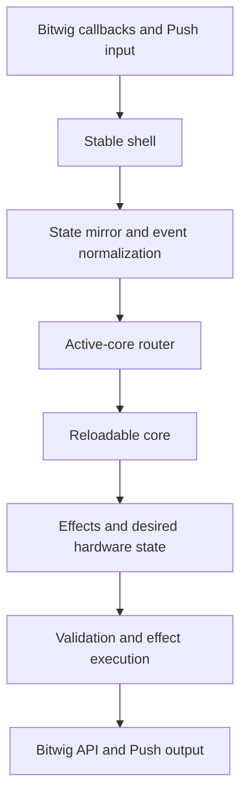
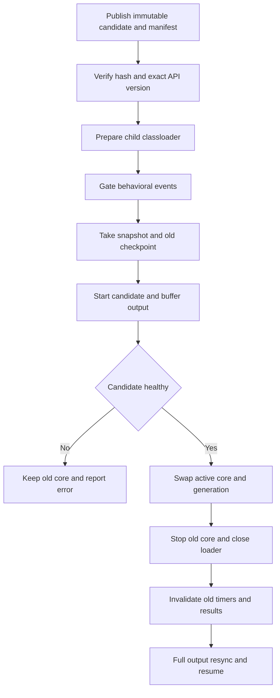

# Reloadable Controller Core

Status: Milestones 1 and 2 are implemented; the transactional loader is next.

Primary goal: make ordinary controller development possible without restarting Bitwig.

## Outcome

Pull will consist of three Maven modules:

```text
pull-core-api   Stable parent-loaded interfaces and immutable messages
pull-core       Child-loaded controller behavior
pull-shell      Bitwig extension, subscriptions, MIDI/USB, and effect execution
```

Bitwig loads `pull-shell` normally. The shell creates one child classloader for the active
`pull-core` JAR. During development it can discard that core and load a new JAR while keeping
Bitwig, its API objects, MIDI ports, note input, and the Push USB connection alive.

A new classloader gives the replacement core fresh class definitions. Core changes may add or
remove classes, fields, methods, packages, and compartment-safe pure-Java dependencies without
using JVMTI class redefinition or restarting Bitwig.

The governing rule is:

> The shell owns resources and side effects. The core receives immutable state and events and
> returns immutable effects and desired hardware output.

## Priorities

1. Eliminate Bitwig restarts for normal behavior, mapping, mode, and rendering work.
2. Make the development command compile, publish, reload, and report the exact active build.
3. Make core behavior testable without Bitwig through fake snapshots and effect assertions.
4. Add record/replay for real Bitwig sessions after the first vertical slice works.

Testing is enabled by the same boundary; it is not a separate mock of the entire Bitwig API.

## Non-goals

- Rust, JNI, subprocesses, or IPC.
- Dynamically replacing the Bitwig shell.
- Exposing Bitwig remote objects to the core.
- Child-loading the current callback-heavy object graph unchanged.
- Registering core-owned observers, commands, light suppliers, threads, or raw `Runnable`s.
- Guaranteeing zero restarts for extension metadata, ports, USB discovery, settings schema, or
  Bitwig state the shell never subscribed to.

## Delivery sequence

These are implementation milestones. The current branch combines milestones 1 and 2; keep the
loader and later behavior migration as independently reviewable commits.

### Milestone 1: Mechanical Maven split

- Convert the repository root into a parent reactor.
- Move all existing behavior unchanged into `pull-shell`.
- Create empty `pull-core-api` and `pull-core` JAR modules.
- Preserve `de.mossgrabers:Pull`, `target/Pull.bwextension`, and the release ZIP.
- Make `pull-shell` depend on `pull-core-api`.
- Make `pull-core` depend on `pull-core-api` as `provided`.
- Do not make `pull-shell` depend normally on `pull-core`.
- Prove the extension's functional archive contents are unchanged.

### Milestone 2: Core API and offline harness

- Add the minimal lifecycle API and immutable DTOs.
- Add fake snapshots, a fake effect executor, and deterministic clock support.
- Add a no-op/canary core with unit tests.
- Enforce that the core has no Bitwig or shell dependencies.

### Milestone 3: Transactional loader and fast development command

- Embed the production core JAR as a nested resource, never exploded classes.
- Add the child-first runtime classloader and `RuntimeManager`.
- Add atomic candidate publication, build IDs, status, failure fallback, and full redraw.
- Add the compile/publish/reload command and classloader fixture tests.
- Prove that core version B may add a class, field, and method over version A.

### Milestone 4: Drum-fill vertical slice

- Mirror the already-observed visible clip names into an immutable snapshot.
- Route one existing drum control through a stable proxy.
- Match clips containing `fill` inside the core.
- Return validated launch/release and light effects.
- Test the behavior without Bitwig, then smoke-test live reload in Bitwig.

### Later milestones

- Generalize stable proxies for every existing Push input.
- Migrate drum behavior, then remaining mode/view families.
- Move display decisions and add golden output tests.
- Add event recording and offline replay.
- Retire JVMTI as the default development path.

## Current lifecycle

Bitwig discovers
[`Push2ControllerExtensionDefinition`](../pull-shell/src/main/java/de/mossgrabers/bitwig/controller/ableton/push/Push2ControllerExtensionDefinition.java),
which creates
[`PushControllerSetup`](../pull-shell/src/main/java/de/mossgrabers/controller/ableton/push/PushControllerSetup.java).
[`GenericControllerExtension`](../pull-shell/src/main/java/de/mossgrabers/bitwig/framework/extension/GenericControllerExtension.java)
delegates Bitwig's `init`, `flush`, and `exit` lifecycle to that setup.

[`AbstractControllerSetup.init()`](../pull-shell/src/main/java/de/mossgrabers/framework/controller/AbstractControllerSetup.java)
currently creates one connected graph containing settings, model banks, subscriptions, MIDI/USB,
modes, views, observers, commands, hardware bindings, and light suppliers. Concrete drum objects
are created once in `PushControllerSetup.createViews()`. Permanent pad bindings then call the
active concrete view through
[`AbstractControlSurface`](../pull-shell/src/main/java/de/mossgrabers/framework/controller/AbstractControlSurface.java).

Standard class redefinition can replace compatible method bodies, but it cannot reshape those
already-live objects or rerun their constructors. Re-registering the graph duplicates callbacks
and retains old objects. The target design inserts one permanent router before behavior.

## Target data flow



All arrows are ordinary in-process Java calls. There is no serialization or network transport.

## Stable shell responsibilities

The shell owns anything coupled to Bitwig or physical hardware:

- extension UUID, metadata, port counts, discovery, and USB matchers;
- `ControllerHost`, setup factory, settings UI, and concrete `com.bitwig.*` adapters;
- model/cursor/bank creation, interested properties, and observers;
- Bitwig preferences and document-setting registration;
- MIDI input/output, SysEx, note translation, and the low-latency note path;
- Push inquiry, sensitivity, ribbon, palette, and hardware bootstrap;
- USB display ownership, buffers, queues, and shutdown;
- one permanent binding for every known Push control and light;
- canonical Bitwig snapshot and pressed/touched-control state;
- timer scheduling, generation fencing, and effect execution;
- classloading, reload status, logging, and safe fallback.

The shell may reuse the existing `ModelImpl` and Bitwig wrapper graph internally. That graph must
not cross into the core.

## Reloadable core responsibilities

The core owns behavior that should be cheap to change:

- logical modes and views;
- mappings and gesture state machines;
- drum behavior and fill matching;
- configuration interpretation;
- navigation and selection policy;
- display layout decisions;
- desired pad, button, ribbon, and display state;
- feature-specific helpers and safe pure-Java dependencies.

Existing modes/views cannot simply be moved. Many register observers or scheduled lambdas into
parent-owned collections with no removal path. Each feature must first be converted to stable
events and effects.

## Boundary rules

1. No `com.bitwig.*` type crosses into the core.
2. Do not pass `IModel`, `PushControlSurface`, `IHost`, `IView`, `IMode`, or `Configuration`.
3. Only core-API types, JDK value types, and defensively copied primitive data cross.
4. The core registers no observers, callbacks, commands, lights, or shutdown hooks.
5. The core creates no threads or executors.
6. Timers are requested as effects and returned as generation-tagged events.
7. The core performs no Bitwig calls; it returns effects.
8. Core handlers are synchronous, bounded, and contain no I/O or sleeps.
9. No child object, exception, lambda, reflection object, or classloader is cached by the shell.
10. Core dependencies must be pure Java and safe to discard with the classloader.

Build checks must reject core imports of Bitwig/shell packages, a core dependency on the shell,
duplicate API classes in the core JAR, and exploded core implementation classes in the extension.

## Initial API shape

```java
public interface CoreProvider
{
    CoreDescriptor descriptor ();

    ControllerCore create ();
}

public interface ControllerCore
{
    CoreResult start (ControllerSnapshot snapshot, Optional<StateEnvelope> previousState);

    CoreResult handle (CoreEvent event, ControllerSnapshot snapshot);

    StateEnvelope checkpoint ();

    void stop ();
}
```

The descriptor includes the exact API version, build ID, state schema, and required shell
capabilities. The state envelope is opaque bytes owned by the core; Java object serialization is
forbidden. If it is absent or incompatible, the new core starts from the authoritative shell
snapshot.

## Snapshot and effects

The milestone-2 snapshot deliberately contains only revision, monotonic time, shell capabilities,
and pressed/touched controls. Add each new domain as a typed API value when its first migrated
vertical slice needs it. The eventual stable snapshot is expected to cover:

- revision and shell capabilities;
- transport;
- visible track/scene/clip window;
- selected track/device and parameter page;
- drum/note context;
- configuration values;
- pressed/touched controls;
- separate generations for mutable Bitwig bank windows.

Bitwig bank indices are not durable identities. Before executing a scroll, the shell increments
that bank's generation and marks it pending. Location-targeted effects from the prior generation
are immediately rejected. The new window is published only after Bitwig's observed membership
stabilizes.

Milestone 2 includes logical timer effects and complete desired RGB light state. Later typed effects
will cover clip/scene launch, selection, bank scrolling, parameter adjustment,
transport/application actions, note mapping/repeat, approved MIDI/SysEx, notifications, and richer
desired hardware state.

Adding behavior composed from existing snapshot data and effects is a core-only change. Adding a
new state domain or executor is a shell-capability change.

## Transactional reload



Requirements:

- Candidate JARs have unique names and are never overwritten while loaded.
- API version and SHA-256 are verified before any core class is loaded.
- Only one candidate is prepared; newer builds supersede older request generations.
- Provider construction, checkpoint, startup, swap, and effect application are serialized on
  Bitwig's controller thread.
- Physical held-state is updated before gating and hydrated into the candidate.
- Real-time note forwarding remains active during the behavioral swap.
- Candidate effects are buffered until commit.
- Any candidate failure leaves the old core running.
- Old `stop()` must be non-blocking and latency-instrumented.
- Old-generation timers, results, and stale bank effects are ignored.
- Success forces complete pad/button/ribbon/display replay, bypassing render caches.
- Extension exit rejects new candidates, joins the loader worker, closes candidate/active loaders,
  and shuts model/MIDI/USB exactly once.

## Classloading and packaging

`pull-core-api` is parent-loaded and contains only immutable contracts. `pull-core` depends on it
as `provided`. `pull-shell` contains the API but must not have the core implementation on its
ordinary runtime classpath.

The production core is embedded later as a nested JAR resource and extracted before loading. The
development loop publishes unique core JARs plus an atomic properties manifest under a stable
user directory that Bitwig does not purge.

The milestone-2 canary uses a fixed packaging-test build ID. Milestone 3 replaces it with the
unique manifest build ID and requires exact activation acknowledgement.

The runtime loader is:

- parent-only for JDK and core-API packages;
- child-first for core implementation/dependency packages;
- deny-listed for `com.bitwig.*` and shell packages;
- prohibited from falling back to parent core implementation classes.

A scoped `ServiceLoader` finds exactly one provider. Any temporary thread context classloader is
restored in `finally`. Maven Shade must preserve the provider service entry.

## Development loop

The fast command must:

1. classify changes as core-only versus shell/API;
2. compile/package only the core and required API;
3. publish a unique immutable JAR and atomic manifest;
4. request reload;
5. wait for status containing the exact requested build ID;
6. fail with an actionable reason if a Bitwig restart is required.

Build success alone is not reload success.

## Testing

Core tests run without Bitwig by feeding snapshots/events and asserting effects/hardware state.
The first harness includes fake time and no sleeping. Classloader integration fixtures load A,
then a structurally different B, then reject a broken C while B remains active.

Shell tests cover normalization, bank fencing, effect validation, held-control hydration, timer
generations, output coalescing, candidate failure, and shutdown barriers.

Later record/replay logs contain only API DTOs: initial snapshot, ordered events/revisions,
effects, rejections, and desired output. A real Bitwig failure can then become an offline test.

## Restart matrix

| Change | Required action |
| --- | --- |
| Core method body | Compile and core reload |
| Add/remove core class, field, method, or package | Compile and core reload |
| Safe pure-Java core dependency | Package and core reload |
| Mapping, mode, gesture, layout policy, or fill matching | Core reload |
| Behavior using existing snapshot/effects | Core reload |
| New Bitwig state the shell never subscribed to | Shell build/install and Bitwig restart |
| New operation the shell cannot execute | API/shell build/install and Bitwig restart |
| Bitwig settings schema | Shell build/install and Bitwig restart |
| MIDI ports, discovery, UUID, API version, or USB matcher | Shell build/install and Bitwig restart |
| Raw hardware bootstrap or permanent binding topology | Shell build/install and Bitwig restart |

## Acceptance criteria

- Structural core changes activate without changing Bitwig PID, extension instance, ports, or USB.
- Publication-to-active reload and forced redraw take less than 500 ms, excluding compilation.
- A corrupt, incompatible, or throwing candidate leaves prior behavior operational.
- One hundred reloads do not add threads, duplicate callbacks, or reopen USB.
- Closed loaders become collectable in a controlled weak-reference/forced-GC test.
- Reload while controls are held produces no stuck modifier, pad, note, or momentary action.
- Stale bank effects and old-generation timers cannot act.
- Core behavior and output tests run without Bitwig.
- Missing capabilities are rejected explicitly.
- The development command reports success only when its exact build ID is active.
- Every remaining Bitwig restart maps to a row in the restart matrix.

## Explicitly rejected shortcuts

- Passing the existing `IModel` into the core.
- Registering child-owned observers and trying to remove them later.
- Installing a second MIDI callback for a migrated control.
- Adding a normal shell dependency on `pull-core` and shading its classes into the extension.
- Treating a successful JVMTI redefine as the architecture.
- Claiming reload success without build-ID acknowledgement from the running shell.
- Hiding missing Bitwig data behind null/default values instead of declaring a capability.
