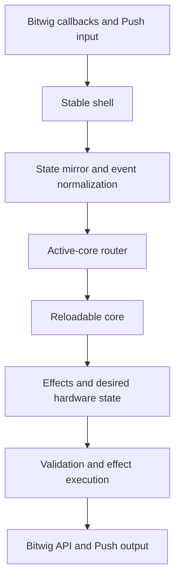
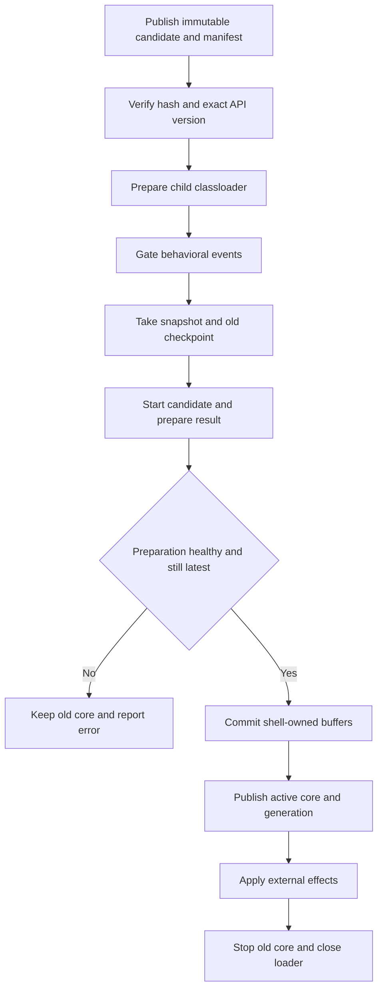

# Reloadable Controller Core

This document defines class loading, publication, runtime transactions and the stable shell/core
boundary. [ARCH](../ARCH.md) is the canonical current capability inventory; the
[views contract](views-api-design.md) defines pages and input-owner lifetimes. Working source uses
Core API 47 and checkpoint schema 6, separately from Bitwig controller API 25. Installed-build and
live-verification status belong to the [validation record](migrations/core-page-ownership-live-smoke.md).

Primary goal: make ordinary controller development possible without restarting Bitwig.

## Outcome

Pull's runtime split and development tool are separate Maven modules:

```text
pull-core-api   Stable parent-loaded interfaces and immutable messages
pull-core       Child-loaded controller behavior
pull-core-bundle   Resource-only build edge that nests the current core JAR
pull-core-publisher   Development-only immutable publication/status tool
pull-shell      Bitwig extension, subscriptions, MIDI/USB, and effect execution
```

Bitwig loads `pull-shell` normally. The shell creates one child classloader for the active
`pull-core` JAR. During development it can discard that core and load a new JAR while keeping
Bitwig, its API objects, MIDI ports, note input, and the Push USB connection alive.

A new classloader gives the replacement core fresh class definitions. Core changes may add or
remove classes, fields, methods, packages, and compartment-safe pure-Java dependencies without
using JVMTI class redefinition or restarting Bitwig.

The governing rule is:

> The shell owns resources and side effects. The core receives immutable state and events and
> returns immutable effects and desired hardware output.

This does not give the shell ownership of product semantics. New or changed mappings, gesture
meaning, navigation, workspace/view policy, colors, layout, animation, and feedback meaning always
belong in core. If the installed canopy is missing a prerequisite, add the smallest reusable
parent-loaded capability and complete the core migration in the same vertical slice, or stop and
report the feature as not ready. Existing stable behavior may remain unchanged as frozen migration
debt; it may not be extended as an interim implementation.

The shell “renders” only mechanically: it validates scenes, clips, rasterizes, maps palettes,
encodes protocols, and writes hardware. The core renders semantically: it chooses content, state,
color, geometry, timing, and composition.

## Priorities

1. Eliminate Bitwig restarts for normal behavior, mapping, mode, and rendering work.
2. Make the development command compile, publish, reload, and report the exact active build.
3. Make core behavior testable without Bitwig through fake snapshots and effect assertions.
4. Add record/replay for real Bitwig sessions after the first vertical slice works.

Testing is enabled by the same boundary; it is not a separate mock of the entire Bitwig API.

## Non-goals

- Rust, JNI, subprocesses, or IPC.
- Dynamically replacing the Bitwig shell.
- Exposing Bitwig remote objects to the core.
- Child-loading the current callback-heavy object graph unchanged.
- Registering core-owned observers, commands, light suppliers, threads, or raw `Runnable`s.
- Guaranteeing zero restarts for extension metadata, ports, USB discovery, settings schema, or a
  Bitwig proxy/property the shell did not install and mark interested during initialization.

## Delivery sequence

These are implementation milestones. Milestones 1 through 3 are preserved as one testable
checkpoint; milestone 4 is a separate branch/checkpoint so either stage can be installed and tested
independently.

### Milestone 1: Mechanical Maven split

- Convert the repository root into a parent reactor.
- Move all existing behavior unchanged into `pull-shell`.
- Create empty `pull-core-api` and `pull-core` JAR modules.
- Preserve `de.mossgrabers:Pull`, `target/Pull.bwextension`, and the release ZIP.
- Make `pull-shell` depend on `pull-core-api`.
- Make `pull-core` depend on `pull-core-api` as `provided`.
- Do not make `pull-shell` depend normally on `pull-core`.
- Prove the extension's functional archive contents are unchanged.

### Milestone 2: Core API and offline harness

- Add the minimal lifecycle API and immutable DTOs.
- Add fake snapshots, a fake effect executor, and deterministic clock support.
- Add a no-op/canary core with unit tests.
- Enforce that the core has no Bitwig or shell dependencies.

### Milestone 3: Transactional loader and fast development command

- Embed the production core JAR as a nested resource, never exploded classes.
- Add the child-first runtime classloader and `RuntimeManager`.
- Add a resource-only bundle so Maven orders core before shell without exposing core classes.
- Add atomic candidate publication, build IDs, status, transactional candidate rejection, and
  generation fencing.
- Fingerprint the complete parent-loaded core API input so API drift requires a restart without
  blocking core reloads on unrelated shell implementation edits.
- Add the compile/publish/reload command and classloader fixture tests.
- Prove that core version B may add a class, field, and method over version A.

### Milestone 4: Drum-fill vertical slice

- Page across every scene on the selected track, publish an empty generation fence when topology
  changes, then expose only complete immutable catalogs.
- Permanently route the 12 otherwise-unused pads directly above Drum Pads' yellow rate controls.
- Match selected-track clips containing `fill` case-insensitively inside the core, keep scene
  order, and assign the first 12 one per pad.
- Back each control with a private startup-created one-slot actuator that arms asynchronously and
  freezes while it owns the session's single acquired lease.
- Keep one acquired fill lease above an opaque Bitwig-owned base. A later press becomes the latest
  value-only pending intent; return and retire the active fill before resolving and launching that
  replacement from the same base.
- Publish complete per-pad RGB state from authoritative shell read-back: dim orange ready, fully
  lit orange only for the active session owner, and off otherwise. Never infer success
  optimistically from a press request.
- Cover catalog scans, off-window edits, readiness, overlapping holds, reload hydration, exact
  delayed Return acknowledgements, releases, failures, and transaction ordering without Bitwig.

### Milestone 5: Bounded API 9 controller bridge

- Install permanent arbitration around the practical Push inputs that already have stable hardware
  bindings, without registering duplicate MIDI or Bitwig hardware callbacks.
- Let each core result replace complete desired input routes and desired bridge-state
  subscriptions.
- Expose typed, immutable transport, private selected-track, controller-layout, and bounded drum
  snapshots only for explicitly requested domains.
- Execute typed absolute transport, generation-fenced selected-track, target-neutral note-input
  MIDI, and identity-fenced drum-pad effects.
- Retain controller-owned state across reload safely: edge-route leases survive through release,
  motion is coalesced to a controller tick, and stateful note-input MIDI is neutralized at ownership
  and lifecycle boundaries.

### Milestone 6: Fixed-view API 10 workspace selection

- Compile migrated core behavior as deterministic fixed-footprint views with explicit input,
  output, and observer claims.
- Publish one complete `DesiredControllerWorkspace` containing a diagnostic name and known fixed
  facets. Stable adapters validate and realize facets but never select combinations by name.
- Keep workspace composition, Shift + Session entry, Session/Note exit, and checkpoint restoration
  in the reloadable core. The first composite is specified in
  [Views API and Composite Workspaces](views-api-design.md).
- API 24's controller-workspace capability v2 adds explicit Track/Mix-page and full-Session facets.
  Session/Note destination views remain desired state until the controller-layout snapshot
  acknowledges the requested stable layout; the shell never infers the destination from mode
  history.

### Milestone 7: API 11 composite grid pressure

- Publish typed Off/Poly/Channel/CC pressure configuration and the active drum base note with the
  bounded controller-layout snapshot.
- Treat pad edges and per-pad pressure as companion inputs of the fixed playable drum area, with
  aggregate channel pressure modeled separately.
- Move VS Live's playable 4x4 pressure mapping into the reloadable `DrumPlayPadView` composed with
  `DrumControllerView`; leave its stable workspace adapter inert so output cannot be duplicated.
- Admit poly pressure to the permanent NoteInput MIDI effect and neutralize each outstanding note
  across core handoff, selected-target change, and shutdown.

### Milestone 8: API 12 declared Session bank shapes

- Add the fixed Session track/scene window to `DesiredControllerWorkspace`; VS Live declares `8x4`.
- Eagerly install only the deduplicated `8x8` and `8x4` Bitwig banks required by current views.
- Let core choose among installed shapes while stable preserves offsets, switches the model's current
  main bank, and enables clip-launcher feedback only for the active bank.
- Reject undeclared shapes and shapes that do not match the fixed workspace adapter before activation.

### Milestone 9: API 14 parameter leases and core snapback

- Expose named bounded banks for active compatibility, project remote, selected-device remote,
  visible-track volume/pan, and fixed globals.
- Let each compiled view select installed banks and map physical continuous controls to their slots.
  Stable publishes opaque target identity/generation plus authoritative parameter metadata and
  values; it does not decide which Push knob means which slot.
- Migrate project-macro relative encoder mutation to core as the first complete parameter-input
  path; retain only touch/delete and display adaptation in stable.
- Let core retain a complete replayable target-to-baseline lease set and request absolute restores
  only through those exact leases.
- Compile physical edge inputs into semantic actions with declared state-invalidation scopes, then
  let interaction policy admit or defer those actions without knowing their button IDs.
- Move the Shift snapback state machine, settlement, read-back acknowledgement, and semantic-action
  barrier into the reloadable core. Stable retains only live Bitwig actuators, exact leases,
  best-effort invalidation restoration, and deferred dispatch for unmigrated stable actions.
- Fence core replacement while a semantic action or its stable dispatch remains pending.

### Later milestones

- Migrate the remaining inherited mode/view mechanics behind typed capabilities so more workspace
  facets can render and act directly from reloadable core output.
- Add stable complete-output arbitration for general Push lights and displays, then move their
  policy into the core and add golden output tests.
- Add event recording and offline replay.
- Retire JVMTI as the default development path.

## Current lifecycle

Bitwig discovers
[`Push2ControllerExtensionDefinition`](../pull-shell/src/main/java/de/mossgrabers/bitwig/controller/ableton/push/Push2ControllerExtensionDefinition.java),
which creates
[`PushControllerSetup`](../pull-shell/src/main/java/de/mossgrabers/controller/ableton/push/PushControllerSetup.java).
[`GenericControllerExtension`](../pull-shell/src/main/java/de/mossgrabers/bitwig/framework/extension/GenericControllerExtension.java)
delegates Bitwig's `init`, `flush`, and `exit` lifecycle to that setup.
[`ReloadableControllerSetup`](../pull-shell/src/main/java/de/mossgrabers/pull/shell/runtime/ReloadableControllerSetup.java)
now wraps those calls so the reload supervisor starts after stable startup, drains candidates before
each stable flush, and closes before the existing setup releases model/MIDI/USB resources.

[`AbstractControllerSetup.init()`](../pull-shell/src/main/java/de/mossgrabers/framework/controller/AbstractControllerSetup.java)
currently creates one connected graph containing settings, model banks, subscriptions, MIDI/USB,
modes, views, observers, commands, hardware bindings, and light suppliers. Concrete drum objects
are created once in `PushControllerSetup.createViews()`. Permanent pad bindings then call the
active concrete view through
[`AbstractControlSurface`](../pull-shell/src/main/java/de/mossgrabers/framework/controller/AbstractControlSurface.java).

Standard class redefinition can replace compatible method bodies, but it cannot reshape those
already-live objects or rerun their constructors. Re-registering the graph duplicates callbacks
and retains old objects. API 9 inserts one permanent router before behavior instead.

## Target data flow



All arrows are ordinary in-process Java calls. There is no serialization or network transport.

## Milestone-4 vertical slice

The first migrated surface is the otherwise-unused 3x4 region immediately above the four yellow
rate controls while Drum Pads is active:

```text
64 65 66 67   manually mappable control pads
56 57 58 59   fill candidates 5-8
48 49 50 51   fill candidates 1-4
40 41 42 43   existing yellow rate controls
```

The permanent surface router owns the eight fill pads' down/up events and the four control pads'
mapping gestures. The existing drum translation matrix maps all of them to `-1`, so they do not
leak musical notes. The legacy 4x4 drum block, rate controls, and Select + Repeat Bitwig transport
fill mode are unchanged.

During extension initialization, before reloadable behavior runs, the shell creates one private
eight-scene scanner cursor and eight private one-scene actuator cursors. The scanner follows the
framework-selected track, walks every scene in pages, and requires two coherent samples per page.
A selected-track or scene-count change immediately publishes an empty new-generation fence, so all
pads stay off while the replacement sweep converges; after that, only complete catalogs are
published. Eight is a throughput/page-size choice, not a project-size cap. Continuous sweeps make
edits outside the current Bitwig session view eventually visible. The core receives selected-track
clips in absolute scene order with names and opaque IDs—never Bitwig objects, banks, or indices.

The core filters names containing `fill` case-insensitively, keeps catalog order, takes at most eight,
and publishes a complete desired control-to-target binding map. Each actuator parks on its desired
track/scene and becomes armed only after two samples agree on track identity, pinned state, scene
index, clip name, existence, and content. The shell returns that separately as the verified armed
map. A pad
is actionable only when its exact desired target is already armed; a down during convergence is
ignored rather than queued for a surprise later launch.

Each pad has its own private actuator, but a fill session acquires at most one actuator at a time.
The session is an opaque Bitwig-owned base plus one optional active fill lease and one optional
value-only pending intent. The base is the launcher clip or Arrangement playback that Bitwig owned
before the gesture; the controller API does not expose one durable identity covering both forms, so
the shell deliberately does not guess it. A pending intent contains only owner, catalog generation,
target ID, and launch policy. It owns no Bitwig proxy, never appears as the active owner, and is not
included in session read-back.

A ready press from the base prepares and launches that exact target. While a fill is active, a
later press replaces the pending intent—latest press wins—but does not prepare or launch the
replacement yet. The handoff observes the active fill busy, submits its native `Return`, waits for
a later non-busy sample, retires the exact actuator, waits one further host sample, revalidates the
pending generation and armed binding, and only then prepares and launches the replacement. Bitwig
does not expose the Return anchor: the non-busy sample proves only that the released target stopped,
and the extra sample is the strongest available opaque-base barrier rather than direct proof of
which launcher clip or Arrangement source resumed. This serialization prevents the replacement's
ALT release destination from becoming the previous fill in the observed native behavior. A newer
press may replace the pending intent; releasing that pending owner cancels it. Releasing the
eventual replacement later uses its own native `Return`; no older controller-held fill lease is
retained beneath it.

Raw MIDI note-off is observed below the command layer, so switching views cannot consume the only
release. Bitwig's void launch calls are command submissions, not acknowledgements. The active
actuator remains frozen while `isPlaying`, `isPlaybackQueued`, and `isStopQueued` provide
authoritative progress. A stale false value before the launch has ever been observed busy cannot
acknowledge an early Return. A failed Return keeps the exact active lease and latest pending intent
owned for retry; no replacement proxy is reserved across that wait. A down rejected while unarmed,
or a deferred target whose catalog generation/binding changes before launch, is discarded rather
than launched later by surprise.

Core API 9 carries the host-independent launch policy.
Capability `effect.clip-launch-hold` version 4 defines the single-active session and latest-pending
handoff; `snapshot.clip-launch-session` version 1 reports a map containing at most the one acquired
owner-to-target lease plus its authoritative active owner. There are no hidden fills or held-pad
fallback. The shell freezes the launch policy into the acquired lease and maps it to Bitwig
API 25. The current fill policy launches with quantization `Immediate` and mode `Legato from Clip
(or Project)`, then invokes the fill clip's ALT release lane. Entry therefore ignores the source and
fill clips' configured launch quantization and mode. Bitwig's API cannot name a release action
directly, so the effective ALT release action on each fill must resolve to `Return`; with the clip
on `Use Project Setting`, this is the project's default ALT Release setting. Clip looping and
length remain session content.

Physical held state, desired/armed bindings, the acquired lease, latest pending intent, opaque base
token, and authoritative active owner live in the shell across a hot core reload. Starting a
replacement core hydrates current held, armed, and acquired-session read-back but
deliberately synthesizes no press. The core renders fully lit orange only after Bitwig reports the
acquired owner playing; neither the input nor pending intent is optimistic feedback.
Snapshot-change delivery remains pending until a core accepts it, so an intervening input or
rejected render cannot permanently lose read-back. Requested, queued, playing, release-requested,
retired, base-barrier, and pending are distinct states.

Structural scene insertion/reordering during a hold remains an inherent limitation of Bitwig's
paged slot proxies, which expose no durable clip ID, but the pinned track and frozen scene proxy are
the narrowest supported identity. Whole-extension disable/exit is also different from hot core
reload: API 25 gives `exit()` no asynchronous grace/completion contract, so shutdown can submit one
best-effort Return for the single acquired fill but cannot wait for confirmation. `scheduleTask()`
is not a safe substitute after exit.

### Selected-track observation and composed controller state

During extension initialization, the shell creates one controller-private, selection-following
cursor for authoritative state, actions, stable identity, drum-capability detection, and one
bounded direct note-source actuator. The permanent Push Pads `NoteInput` is removed from Bitwig's
`All Inputs` pool. The cursor is never exposed to Push's pin command.

Each active core view contributes declarative controller state: fixed stable-controller facets,
an optional full-grid Note layout, and an optional generation/channel-fenced selected-track route.
The workspace compiler merges disjoint contributions into one `DesiredControllerState` and rejects
physical overlap. Full-grid Note therefore owns its layout plus route, while the lower-half drum
controller in Shift+Session owns its composite drum facet plus the same route and automatic-roll
lease. A composite does not need special routing policy merely because it shares the grid.

One stable `ControllerStateHost` owns the complete transition. It validates the target and submits
the direct route before activating any entering musical surface. On normal exit it commands the
real Track/Session neutral layout, waits for held pad and sustain lifecycles, neutralizes
parent-owned raw MIDI state, removes the route, and only then activates the incoming workspace.
A selection-identity disagreement neutralizes and removes immediately, then quarantines a new
submission until the selected target and viewer agree and musical input is idle. Core replay
reasserts the same complete state without route churn; core invalidation neutralizes and removes
immediately. Ordinary identical results do not reassert stable actuators, so Device, Browser,
Scales, and other stable modal overlays preserve the underlying Note viewer and route. Entry and
failure cleanup roll back the route if surface activation fails. Bitwig
exposes no route-attachment read-back, so this is ordered topology submission, not an
acknowledgement claim. The stable shell advances a layout generation only when its complete visible
layout state changes; a destination request cannot be retired by the stale layout sampled before
that request. There is no fallback to `All Inputs`.

Bitwig documents `Track.addNoteSource(NoteInput)` as routing directly regardless of monitoring, but
the API-21 physical smoke test still observed Bitwig's normal monitor gate: with monitor mode
`Auto`, the selected track sounded only while armed. Pull treats that host behavior as authoritative
and does not write arm or monitor mode as part of Note-view ownership. A project track explicitly
configured for the named `Pads` input can still receive the permanent input independently; the API
does not provide a controller-side way to revoke that explicit project route.

That same private cursor owns a permanently bounded four-candidate drum-device canopy: one native
Drum Machine match on the selected track chain, Bitwig's semantic `FIRST_INSTRUMENT` cursor itself
when it reports drum pads, one native match on its first layer, and one native match on its cursor
slot. Capability requires one complete candidate whose `exists` and `hasDrumPads` read-back are
both true; state from separate candidates is never combined. This covers the ordinary ungrouped and
one-container grouped layouts without claiming arbitrary recursion, additional layers, or parallel
branches. Its target
`exists`, `canHoldNoteData`, and candidate read-back define selected-target drum applicability
independently of the visible view. New fill gestures require both that capability and explicit
Drum Pads layout ownership; an already-held fill still releases after either state changes. The
user-pinnable model cursor is never used as applicability truth. Because the current drum renderer
still consumes that model cursor, the stable shell also compares its stable Bitwig channel ID with
the private selected target on every controller tick. A Track Pin divergence fails closed: drum
mapping, indication, fills, rates, and ribbon ownership disengage until both proxies represent the
same track. It does not redirect the ordinary `NoteInput` stream.

The musical-data seam deliberately stops at raw MIDI. A drum track that should interpret the
ribbon configures that interpretation visibly in the Bitwig project: disable `P. Bend → Expr.`, use
native Bend plus a MIDI `BEND` modulator for expression-aware instruments, and map a separate MIDI
`BEND` modulator to the pitch parameter of plug-ins that do not consume Bitwig note expression.
The controller does not insert or own those devices.

## Stable shell responsibilities

The shell owns anything coupled to Bitwig or physical hardware:

- extension UUID, metadata, port counts, discovery, and USB matchers;
- `ControllerHost`, setup factory, settings UI, and concrete `com.bitwig.*` adapters;
- model/cursor/bank creation, interested properties, and observers;
- Bitwig preferences and document-setting registration;
- MIDI input/output, SysEx, note translation, and the low-latency note path;
- Push inquiry, sensitivity, ribbon, palette, and hardware bootstrap;
- USB display ownership, buffers, queues, and shutdown;
- one permanent binding for every migrated Push control and light;
- canonical Bitwig snapshot and pressed/touched-control state;
- capability validation, target/generation fencing, and execution for advertised effects;
- classloading, reload status, logging, fault eviction, and transactional candidate rollback.

The shell may reuse the existing `ModelImpl` and Bitwig wrapper graph internally. That graph must
not cross into the core.

## Bounded capability contracts

The shell creates finite Bitwig proxies, interested values, physical bindings and action paths at
extension initialization. Installed capability is distinct from requested publication: every
accepted result replaces the complete `DesiredBridgeSubscriptions` and `DesiredParameterBanks`.
Absent domains publish typed empty state and avoid their high-rate snapshot work. Bounds and
remaining migration scope are listed once in [ARCH](../ARCH.md) and the
[roadmap](reloadable-core-migration-roadmap.md).

### Permanent input and gesture ownership

One router wraps the existing Push bindings after registration. It never adds a parallel MIDI
callback. Its maximum is 256 control-and-kind pairs: command-bound buttons/pads/pedals, 64 pad
pressure lanes, channel pressure, sustain, relative controls and the absolute touch strip. The
continuous candidate list is eight encoders, Master, Tempo, Play Position and touch strip; a kind
exists only when that physical binding exists. Unknown requested pairs fail before commit.

`DesiredInputRoutes` is complete replayable state. An absent route preserves only frozen legacy
behavior; `OBSERVE` delivers both paths; `EXCLUSIVE` suppresses the stable command and requires
specific admission for an already inert binding. Missing or faulted core never revives deleted
policy. Command arbitration does not suppress Bitwig's separate native `NoteInput` musical path.

The parent freezes each edge's route and core generation at BEGIN through LONG/END, below
consumed-button handling. Replacement waits for core-relevant gestures, pending motion and
deferred stable callbacks; a stable-only NONE gesture without a semantic action does not fence it.
Within one core generation, the [view contract](views-api-design.md)
defines target-bound cancellation when the original binding disappears. These are complementary
ownership levels.

Relative deltas sum; absolute and pressure samples keep the latest value until the controller
tick. TOUCH→RELATIVE/ABSOLUTE and PAD→POLY_PRESSURE companions inherit the held edge's route and
generation, and flush before END. Later legacy rebinding remains behind that same callback. Core
cancels changed targets and suppresses the remaining physical tail; see the
[lifecycle contract](interaction-lifecycle.md).

### Semantic action and parameter barriers

Physical ownership and action ordering are separate. Compiled `DesiredControllerActions` declare
bounded semantic variants and invalidation scopes. At BEGIN, core freezes one declared executable
intent and payload; compatibility code resolves only the installed frozen command's actual intent.
The barrier compares those scopes with retained dependencies, never inferring consequences from a
physical button ID. EXCLUSIVE freezes stable suppression before admission; a deferred callback
cannot resurrect suppressed policy. Deferred actions retain physical order and fence replacement.

Shift snapback captures a baseline before the first eligible write and retains its exact target.
Core owns settlement, restoration, later-sample acknowledgement, retries, timeouts and the bounded
queue; shell owns observation and addressable actuators. Touch release alone does not end Shift.
The ten-target interaction bound is separate from the larger named-bank capacity.

A movable `IParameter` wrapper is not an identity: its domain, selected owner, page and role/slot
must still agree at prepare and apply. Unclassified proxies fail closed. New-write eligibility and
old-target addressability are separate; never restore or release through a replacement target.
See [target identity](findings/parameter-target-proxy-coupling.md) and
[Snapback limits](findings/snapback-v1-limitations.md).

### Authoritative observation and effect execution

Subscriptions do not promise arbitrary project access. The private selection-following cursor is
the selected-track observation/action target; a user-pinnable model cursor is not interchangeable.
Drum applicability uses four initialization-created candidates: selected-track top-level Drum
Machine, the semantic first instrument itself, and a Drum Machine in that instrument's first layer
or cursor slot. It does not recurse through arbitrary branches. Rendering and effects require
private/model channel alignment plus the exact device, 16-pad window and pad identity.

Selected-track effects fence generation and channel ID during preparation and again against the
live target during application. Drum effects additionally fence candidate/device, bank base and
pad channel identity. Parameter effects fence their live owner/page/role. A successful void call is
submission; feedback and dependent writes follow later subscribed host state.

Project navigation uses an identity-observed serialized lane. An exact project-transport request
carries the visible origin and engine-owner target; core chooses those identities and requested
state, while the shell executes bounded tab search, transport acknowledgement and exact return.
That transaction can continue across core quarantine/reload and does not itself fence replacement.
It does not establish the [general quiescence](findings/core-reload-quiescence.md) that the user parked.

The native semantic mapping endpoint is a separate actuator: core supplies a document/track/storage
fenced lease and next absolute endpoint; Bitwig owns learned target application. The permanent
matcher accepts positive Note On and ignores release. Feedback uses later mapped-target state;
all 64 raw physical pads remain ordinary-dispatch-only. Capacity, storage acknowledgement,
tombstones and non-reuse are in the
[mapping contract](../pull-core-api/src/main/java/de/mossgrabers/pull/core/api/CONTROLLER_MAPPING_IDENTITY.md);
[remaining lifecycle limits](findings/track-scoped-midi-learn-lifecycle.md) remain active.

Parent-owned raw MIDI state must be neutralized on generation change, direct-route detach,
selection change and shutdown. Outstanding poly-pressure, CC, channel pressure and pitch bend use
the same permanent NoteInput; this is best-effort, target-neutral cleanup, not target-specific undo.

Transport position sampling is bounded to 50 ms while playing; drum snapshots to 33 ms unless
selection changes. Controller ticks over 10 ms and event transactions over 8 ms emit rate-limited
warnings at most once per five seconds. Those measure controller-thread work, not audio DSP. Remove
unneeded subscriptions before cutting useful eager topology.

## Reloadable core responsibilities

The core owns behavior that should be cheap to change:

- logical modes and views;
- mappings and gesture state machines;
- drum behavior and fill matching;
- configuration interpretation;
- navigation and selection policy;
- display layout decisions;
- desired pad, button, ribbon, and display state for output surfaces whose ownership has migrated
  through an installed lane in the canonical architecture inventory;
- feature-specific helpers and safe pure-Java dependencies.

Existing modes/views cannot simply be moved. Many register observers or scheduled lambdas into
parent-owned collections with no removal path. Each feature must first be converted to stable
events and effects.

## Boundary rules

1. No `com.bitwig.*` type crosses into the core.
2. Do not pass `IModel`, `PushControlSurface`, `IHost`, `IView`, `IMode`, or `Configuration`.
3. Only core-API types, JDK value types, and defensively copied primitive data cross.
4. The core registers no observers, callbacks, commands, lights, or shutdown hooks.
5. The core creates no threads or executors.
6. Logical timer DTOs are reserved/test-only: the production shell advertises no timer capability
   or executor, so production core behavior must not emit them while
   `findings/logical-timer-production-gap.md` is active.
7. The core performs no Bitwig calls; it returns effects.
8. Core handlers are synchronous, bounded, and contain no I/O or sleeps.
9. No child object, exception, lambda, reflection object, or classloader is cached by the shell.
10. Core dependencies must be pure Java and safe to discard with the classloader.

Build checks must reject core imports of Bitwig/shell packages, a core dependency on the shell,
duplicate API classes in the core JAR, and exploded core implementation classes in the extension.

## Initial API shape

```java
public interface CoreProvider
{
    CoreDescriptor descriptor ();

    ControllerCore create ();
}

public interface ControllerCore
{
    CoreResult start (ControllerSnapshot snapshot, Optional<StateEnvelope> previousState);

    CoreResult handle (CoreEvent event, ControllerSnapshot snapshot);

    StateEnvelope checkpoint ();

    void stop ();
}
```

The descriptor includes the exact API version, build ID, state schema, and required shell
capabilities. The state envelope is opaque bytes owned by the core; Java object serialization is
forbidden. If it is absent or incompatible, the new core starts from the authoritative shell
snapshot.

## Snapshot and effects

The snapshot contains revision, monotonic time, shell capabilities, the explicitly subscribed
`ControllerBridgeSnapshot`, the complete selected-track clip catalog, verified per-control armed
clip bindings, the clip-launch session's optional acquired owner-to-target lease and authoritative
active owner, and pressed/touched controls. A pending fill intent is shell-private and never appears
active in this read-back. The bridge contains typed transport, private selected-track,
controller-layout, target-fenced note-view, note-repeat, active bounded Session-bank track state,
bounded drum, bounded parameter, semantic controller-mapping feedback,
lightweight project, and current-project/Master contexts; each unsubscribed domain is its typed
empty value.

Checkpoint schema version 4 retains workspace selection, the selected Note/Session destination,
any destination handoff still awaiting layout read-back, and the last authoritative engine-owner
identity and playback state. A normal child-core reload therefore preserves both the complete
controller-view lease and remote Play feedback while another project is visible. The child never
checkpoints or mirrors an in-flight cross-project operation; the stable command host owns it through
completion and fences every active step with live project identity and command read-back.

Every `CoreResult` contains complete desired hardware output, input routes, bridge subscriptions,
clip bindings, composed controller state, controller actions, note-repeat ownership, parameter-bank
selection, parameter interaction state, and ordered one-shot effects. These desired-state
categories are committed together; effects are
validated during the same preparation transaction and applied only after the active core pointer
switches. Candidate parameter-bank preparation restores the active selection before returning, so a
rejected candidate cannot change the old core's sampled targets. This lets a replacement core replay
ownership and subscriptions without registering parent callbacks or inheriting child objects.

Bitwig bank indices are not durable identities. Before executing a scroll, the shell increments
that bank's generation and marks it pending. Location-targeted effects from the prior generation
are immediately rejected. The new window is published only after Bitwig's observed membership
stabilizes.

The API type hierarchy retains logical timer effects for the proposed contract, but they are
not an installed production capability. Installed production capabilities include persistent
desired clip bindings, verified armed bindings, the version-1 authoritative single-lease
clip-launch-session snapshot,
generation-fenced version-4 acquire/replace/release effects, normalized controller-input events and
routes, explicit bridge subscriptions, typed absolute transport effects, generation-fenced
selected-track and drum-pad effects, bounded target-neutral note-input
poly-pressure/CC/channel-pressure/pitch-bend output, named bounded parameter snapshots and exact
leases, generation-fenced relative/reset effects and absolute parameter restores, serialized
current-project navigation/engine effects, stable-owned exact cross-project transport operations,
desired Note layouts with selected-track note-source routing, a leased note-repeat engine, and RGB/display hardware state through the
canonical installed-output lanes above. Later typed domains may cover broader clip launch/selection,
bank scrolling, selected-device parameters, application actions, notifications, and complete
general Push output.

Adding behavior composed from existing snapshot data and installed, capability-advertised effects
is a core-only change. Adding a new state domain or executor is a shell-capability change.

## Transactional reload



Requirements:

- Candidate JARs have unique names and are never overwritten while loaded.
- API version is verified for every candidate; external candidates also verify their published
  SHA-256 before any core class is loaded.
- Only one candidate is prepared; newer builds supersede older request generations.
- Provider construction, checkpoint, startup, swap, and effect application are serialized on
  Bitwig's controller thread.
- Physical held-state is updated before gating and hydrated into the candidate.
- Real-time note forwarding remains active during the behavioral swap.
- Candidate output and effects are fully validated/resolved without mutation, committed as an
  in-memory buffer swap, and applied only after the active core pointer changes.
- A prepare/commit failure keeps the old core active. An external apply failure is logged after the
  new core is active and cannot roll the transaction back halfway through Bitwig calls.
- Any candidate failure leaves the old core running.
- Old `stop()` must be non-blocking and latency-instrumented.
- Old-generation results and stale bank effects are ignored.
- Once an output proxy is migrated, success forces its complete replay while bypassing render caches.
- Extension exit rejects new candidates, requests worker cancellation, waits for a bounded join,
  closes candidate/active loaders, and shuts model/MIDI/USB exactly once. If verification does not
  return before the join deadline, its finalizer performs deferred private-JAR cleanup.

## Classloading and packaging

`pull-core-api` is parent-loaded and contains only immutable contracts. `pull-core` depends on it
as `provided`. `pull-shell` contains the API but must not have the core implementation on its
ordinary runtime classpath.

`pull-core-bundle` has a build-time edge to `pull-core` and contains only the resolved core JAR as
`META-INF/pull/core/pull-core.jar`. `pull-shell` depends on that resource-only bundle, so Maven's
reactor orders core packaging before shell packaging without making core implementation classes a
transitive shell dependency. The bundle deletes its previous nested output before every copy, and
the shell deletes any legacy direct copy before packaging, so an incremental build cannot silently
reuse an old core. The shell extracts the nested resource before loading it.

The development loop publishes unique core JARs plus an atomic properties manifest under a stable
user directory that Bitwig does not purge. The full extension build also embeds
`META-INF/pull-shell.properties`, whose compatibility fingerprint covers the parent-loaded core API
packaging edge, and relevant build descriptors. Core-only changes leave it unchanged.

The embedded production provider and every development candidate use the unique manifest build ID
and require exact activation acknowledgement.

The runtime loader is:

- parent-only for JDK and core-API packages;
- child-first for core implementation/dependency packages;
- deny-listed for `com.bitwig.*` and shell packages;
- prohibited from falling back to parent core implementation classes.

A scoped `ServiceLoader` finds exactly one provider. Any temporary thread context classloader is
restored in `finally`. Maven Shade must preserve the provider service entry.

## Development loop

The fast command must:

1. compute the exact local parent-loaded core API source fingerprint;
2. compile/package only the core, required API, and development publisher;
3. publish a unique immutable JAR and atomic manifest;
4. request reload;
5. wait for status containing the exact requested build ID;
6. fail with an actionable reason if a Bitwig restart is required.

Build success alone is not reload success.

### Publication protocol

The development command and shell share `${user.home}/.drivenbymoss/pull/reload` by default.
`PULL_CORE_RELOAD_DIR` may override it. A core is built with an exact, unique build ID embedded in
`META-INF/pull-core.properties`:

```properties
formatVersion=1
apiVersion=23
buildId=20260731T230000Z-0123456789abcdef0123456789abcdef
```

The publisher copies it once to `pull-core-<buildId>.jar`, forces the complete file to storage,
verifies its embedded API/build identity, computes SHA-256, and atomically replaces
`candidate.properties` in the same directory:

```properties
formatVersion=1
apiVersion=23
shellFingerprint=0123456789abcdef0123456789abcdef01234567
buildId=20260731T230000Z-0123456789abcdef0123456789abcdef
jar=pull-core-20260731T230000Z-0123456789abcdef0123456789abcdef.jar
sha256=0123456789abcdef0123456789abcdef0123456789abcdef0123456789abcdef
```

Successfully published artifact paths are never overwritten. Protocol v1 retains them for
diagnostics; bounded pruning is a future cleanup once artifacts become material in size. The shell atomically replaces
`status.properties` after each attempted activation:

```properties
formatVersion=1
state=active
requestedBuildId=20260731T230000Z-0123456789abcdef0123456789abcdef
activeBuildId=20260731T230000Z-0123456789abcdef0123456789abcdef
message=activated
```

`state` is `active`, `failed`, or `restartRequired`. Failure retains the prior `activeBuildId` and
includes an actionable `message`. The command reports success only when both requested and active
IDs exactly match its build. A stale status is ignored.

Before loading candidate classes, the running shell compares `shellFingerprint` with its embedded
core API fingerprint. Any mismatch is acknowledged as `restartRequired`. This compares exact API
content, not just dirty paths, while deliberately ignoring unrelated shell implementation edits.

## Testing

Use the production core path to prove requested effects, later host read-back and controller
output. Keep shell integration coverage for publication integrity, classloader isolation,
transactional candidate rejection, resource disposal, input ownership and live identity fencing.
Model host advancement separately from submission, including delayed fill release and replacement.
[TESTING](../TESTING.md) defines which behavioral and boundary checks to retain; duplicate internal
structure tests and one-off migration scaffolding are not required.

The DTO seam can support record/replay: initial snapshot, ordered events/revisions, requested
effects, rejections and desired output. This can reproduce failures without emulating Bitwig's
entire Java API; it does not replace exact-build live verification of native host enforcement.

## Restart matrix

| Change | Required action |
| --- | --- |
| Core method body | Compile and core reload |
| Add/remove core class, field, method, or package | Compile and core reload |
| Safe pure-Java core dependency | Package and core reload |
| Core-owned/migrated mapping, mode, gesture, layout policy, or fill matching | Core reload |
| Route a currently registered input between `NONE`, `OBSERVE`, and `EXCLUSIVE` | Core reload |
| Request or stop requesting an existing bridge subscription | Core reload |
| Select a different installed parameter bank or remap an installed bank's encoder turns | Core reload |
| Output policy or physical projection inside the canonical installed inventory | Core reload |
| Behavior using existing snapshots and installed, capability-advertised effects | Core reload |
| Behavior within the installed capability canopy | Core reload |
| Clip launch quantization, mode, or Main-vs-ALT release lane | Core reload |
| Add/change a parent-loaded core API DTO, event, effect, capability, or subscription domain | API/shell build/install and Bitwig restart |
| Add state/action or exceed capacity outside the installed canopy | API/shell build/install and Bitwig restart |
| Register a new physical input kind/control or change permanent input arbitration | Shell build/install and Bitwig restart |
| Add a physical output lane or broaden its installed ownership/capacity | API/shell build/install and Bitwig restart |
| Expand the core Drum Controller beyond its canonical 16-pad window or four fixed drum-device candidates | Shell build/install and Bitwig restart |
| Change permanent `NoteInput` creation, translation, `All Inputs`, or direct-route topology | Shell build/install and Bitwig restart |
| Add or change Bend/MIDI-modulator mappings in a project | No extension restart |
| New Bitwig state with no startup-created proxy/interested property | Shell build/install and Bitwig restart |
| New operation the shell cannot execute | API/shell build/install and Bitwig restart |
| Bitwig settings schema | Shell build/install and Bitwig restart |
| MIDI ports, discovery, UUID, API version, or USB matcher | Shell build/install and Bitwig restart |
| Raw hardware bootstrap or permanent binding topology | Shell build/install and Bitwig restart |

## Acceptance criteria

- Structural core changes activate without changing Bitwig PID, extension instance, ports, or USB.
- Publication-to-active reload and forced redraw take less than 500 ms, excluding compilation.
- A corrupt, incompatible, or throwing candidate leaves prior behavior operational.
- One hundred reloads do not add threads, duplicate callbacks, or reopen USB.
- Closed loaders become collectable in a controlled weak-reference/forced-GC test.
- Reload while controls are held produces no stuck modifier, pad, note, or momentary action.
- A route-map change or core reload during an edge gesture preserves its begin-time ownership
  through release; core replacement waits for the complete input lifecycle to drain, and continuous
  rebinding cannot bypass arbitration.
- Unrequested bridge domains publish typed empty values without domain snapshot construction
  or high-rate sampling/DTO churn.
- Core handoff, route detach, selection change, and shutdown neutralize outstanding target-neutral
  note-input poly-pressure, CC, channel-pressure, and pitch-bend state on a best-effort basis.
- Selected-track and drum effects fail closed after any fenced live identity changes.
- Stale bank effects cannot act.
- Core behavior and output tests run without Bitwig.
- Missing capabilities are rejected explicitly.
- The development command reports success only when its exact build ID is active.
- Every remaining Bitwig restart maps to a row in the restart matrix.

## Explicitly rejected shortcuts

- Passing the existing `IModel` into the core.
- Registering child-owned observers and trying to remove them later.
- Installing a second MIDI callback for a migrated control.
- Adding a normal shell dependency on `pull-core` and shading its classes into the extension.
- Treating a successful JVMTI redefine as the architecture.
- Claiming reload success without build-ID acknowledgement from the running shell.
- Hiding missing Bitwig data behind null/default values instead of declaring a capability.
