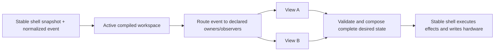

# Views API and Composite Workspaces

Status: design contract for the next Pull milestones. The first two implementation checkpoints are
defined below so code, offline tests, and Push hardware tests can be compared against an explicit
target.

## Goal

Make a controller view a reusable behavior with a fixed, inspectable Push 2 footprint. A workspace
combines views without allowing configuration to remap their behavior onto arbitrary controls.

The important rule is:

> A view decides where its behavior lives. A workspace may include a named facet, omit an optional
> facet, or explicitly replace an overlapping facet, but it cannot wire arbitrary behavior to raw
> hardware.

This keeps authored configurations useful without making them a second controller-programming
language. A bad composition should fail at compile time with both owners and the contested region,
not turn into order-dependent runtime behavior.

## Terms

- **Surface area**: a stable, named physical or rendered part of Push 2.
- **Claim**: one view's declared ownership of an area for input, output, or both.
- **View**: behavior plus a fixed set of required claims and named optional facets.
- **Facet**: a coherent optional part of a view, such as Drum Controller pitch bend. A facet has a
  fixed footprint; it is not a bag of freely assignable callbacks.
- **Workspace**: a named list of view profiles composed for one controller state.
- **Workspace compiler**: validates claims and produces one deterministic input/output owner table.
- **Stable shell**: owns Bitwig objects, MIDI/USB resources, callbacks, and effect execution.
- **Reloadable core**: owns view selection, composition, policy, and replayable desired state.

"Mode" and "view" in the inherited DrivenByMoss framework are implementation details during the
migration. Pull's model uses **view** for a fixed-footprint behavior and **workspace** for the active
composition. Session navigation and mixer controls are orthogonal views; there is no combined
Session/Mix super-view.

## Push 2 Areas

Areas are semantic and bounded. Grid coordinates use `(column, row)` with row 0 at the bottom, the
same orientation as Push 2 MIDI note layout.

```text
ENCODERS[0..7]             turns and touches
DISPLAY.PARAMETERS[0..7]   parameter name, value, and control graphics
DISPLAY.BOTTOM_STRIP[0..7] track/menu labels aligned to the lower soft keys
SOFT_KEYS.UPPER[0..7]      buttons above the display
SOFT_KEYS.LOWER[0..7]      buttons below the display
GRID.UPPER                 columns 0..7, rows 4..7
GRID.LOWER                 columns 0..7, rows 0..3
SCENE_KEYS.UPPER           four side keys aligned to GRID.UPPER
SCENE_KEYS.LOWER           four side keys aligned to GRID.LOWER
NAVIGATION.ARROWS          left, right, up, down
NAVIGATION.PAGE            page left and page right
NAVIGATION.OCTAVE          octave up and octave down
TOUCH_STRIP                touch and pitch/position data plus strip output mode
TRANSPORT.*                named transport controls, claimed individually
GLOBAL_MODIFIERS.*         Shift, Select, Delete, and similar controls
```

Smaller fixed subregions may be added when a real view proves the need. They must be named for a
stable physical footprint, not created ad hoc by a workspace. For example, the current drum-fill
view occupies the twelve pads at columns 4..7 and rows 1..3 inside `GRID.LOWER`.

A claim also declares the channel it uses:

```java
record SurfaceClaim(
    SurfaceArea area,
    ClaimChannel channel,    // INPUT, OUTPUT, or INPUT_OUTPUT
    InputPolicy inputPolicy  // OBSERVE or EXCLUSIVE when input is present
) {}
```

Multiple observers may coexist. There is exactly one exclusive input owner and one output owner
for any atomic area in a compiled workspace.

A grid input claim includes the pad edge, its strike velocity, and per-pad pressure. Pressure is a
companion event for the same physical pad and follows the same compiled owner; it is never enabled
through a separate concrete-view registration list. A view may ignore pressure, and an unmapped
pad has no musical pressure destination. Aggregate channel pressure has no pad identity and remains
a distinct surface-wide input.

The stable shell captures those events and publishes the current typed pressure configuration and
drum base note. A reloadable view owns the mapping from its fixed playable footprint to MIDI effects.
The stable adapter for a core-owned composite must be inert for pressure, while standalone views
which have not migrated may continue through the generic stable view contract.

## Fixed Views

A view exposes named profiles, not arbitrary ports:

```java
interface ControllerView {
    ViewId id();
    ViewProfile profile(ProfileId id);
    ViewResult start(ViewContext context);
    ViewResult handle(CoreEvent event, ViewContext context);
    ViewResult render(ViewContext context);
}

record ViewProfile(
    Set<SurfaceClaim> requiredClaims,
    Map<FacetId, ViewFacet> optionalFacets
) {}

record ViewFacet(
    Set<SurfaceClaim> claims
) {}
```

The actual API may use more focused types as implementation exposes useful invariants. The shape
above is normative: fixed claims live with the view, and configurations select only declared
profiles/facets.

Examples:

- **Drum Controller** requires `GRID.LOWER`. Its lower half contains the 4x4 playable drum block,
  four momentary rate pads, and twelve fill pads. Its named `pitch-bend` facet claims
  `TOUCH_STRIP`. It does not claim either scene-key group.
- **Session Clip Grid (upper)** requires `GRID.UPPER` and may claim `SCENE_KEYS.UPPER` as its named
  `scene-launch` facet.
- **Project Macro Controls** requires `ENCODERS`, `DISPLAY.PARAMETERS`, and encoder touches. It does
  not implicitly own the lower track strip.
- **Track Selection Strip** requires `DISPLAY.BOTTOM_STRIP` and `SOFT_KEYS.LOWER`.
- **Session Navigation** requires `NAVIGATION.ARROWS` and may use `NAVIGATION.PAGE`.

## Workspace Compilation

A workspace is intentionally boring data:

```yaml
name: VS Live
views:
  - use: project-macro-controls
  - use: track-selection-strip
  - use: session-navigation
  - use: session-clip-grid-upper
    facets: [scene-launch]
  - use: drum-controller
    facets: [pitch-bend]
```

The first implementation may construct this exact data in Java. YAML or JSON loading comes only
after the compiler and ownership diagnostics are stable.

Compilation rules:

1. Expand each selected profile and facet into atomic claims.
2. Permit shared `OBSERVE` input claims.
3. Reject overlapping exclusive-input or output claims by default.
4. Permit replacement only through an explicit, named overlay rule that identifies the displaced
   facet and replacement facet.
5. Produce deterministic input and output ownership tables independent of declaration order.
6. Validate required shell capabilities before activation.

V1 has no dynamic negotiation. V2 may allow a workspace to enable or disable named optional facets
based on capabilities, but a view's remaining footprint still cannot move.

## Runtime Flow



Activation is transactional. The candidate workspace compiles and renders a complete initial
result before it replaces the active workspace. Reload captures the active workspace ID and view
state in the checkpoint envelope. A rejected candidate leaves the prior generation active.

## Implementation Checkpoints

### Checkpoint 1: Behavior-Preserving View Runtime

Introduce the fixed-footprint model and workspace compiler inside the reloadable core. Move the
currently migrated behavior through views:

- Drum-fill matching, launch ownership, and twelve pad lights become one fixed drum-fill view.
- Record, Shift + Record, and Select + Record become one fixed Record control view.
- A default workspace composes those views.
- Existing `CoreResult` output, input routes, bridge subscriptions, clip bindings, effects,
  reload semantics, and hardware behavior remain byte-for-byte or value-for-value equivalent.

Offline tests must retain all current behavior cases and add compiler tests for conflicting output,
exclusive input, shared observers, and declaration-order independence. Commit this checkpoint
before adding `VS Live`; it is the rollback point for the first Bitwig/Push smoke test.

### Checkpoint 2: `VS Live` Composite

Add one hardcoded workspace named `VS Live`, entered with **Shift + Session** for now:

- Project Macro Controls own the eight top encoders, their touches, and parameter display, matching
  the current Project side of User mode.
- Track Selection Strip owns the lower display strip and lower soft keys so visible tracks can be
  selected directly.
- Session Navigation owns the arrow keys (and established Session paging behavior) so track/scene
  navigation remains available.
- Session Clip Grid owns the upper four pad rows. Clip launch behavior and scene order match Session
  view, adjusted only for the four-row viewport.
- Drum Controller owns the bottom four pad rows, including its existing 4x4 playable block, rate
  pads, and fill pads.
- Drum Controller's `pitch-bend` facet owns the touch strip.
- Per-pad pressure on Drum Controller's playable 4x4 block follows that same lower-grid ownership;
  pressure on rate, fill, and Session pads has no musical destination.
- `DrumPressureView` implements that policy in the reloadable core. It observes the playable pad
  edges and pressure, honors Off/Poly/Channel/CC configuration, and sends mapped output through the
  permanent NoteInput MIDI effect. `WorkspaceView` performs no parallel pressure mutation.
- No view claims the lower scene keys merely because they sit beside Drum Controller. Upper scene
  keys may launch the four visible Session scenes through the Session grid's named facet.

The first version is deliberately a Java-defined configuration and a hardcoded entry gesture. It
proves that fixed views compose correctly before configuration parsing or dynamic negotiation is
added.

Plain **Session** exits to ordinary Session, while **Note** exits through the existing preferred
note-view selection. Those controls are observed by core so the stable command chooses the legacy
destination first and the same core transaction then releases workspace ownership. Stable code
must not synchronously force the workspace from generic mode/view change listeners; that would race
the exit command and make the complete desired state fight its own transition.

The stable API addition for this checkpoint is limited to one complete
`DesiredControllerWorkspace`: a name plus a set of known fixed-facet IDs. `VS Live`, its selected
facets, its conflict-free composition, and the Shift + Session selection state live in the
reloadable core. The stable shell contains only reusable adapters for facet mechanics that still
depend on the inherited Bitwig/DrivenByMoss object graph. There must be no stable-shell branch on
the name `VS Live`. As individual grid, parameter, display, and navigation capabilities cross the
core boundary, those adapters can be replaced without changing workspace configuration.

The Bitwig smoke test checks:

1. Existing startup and ordinary Session/Drum/User behavior still work.
2. Shift + Session enters `VS Live` without a stuck Shift gesture.
3. Encoders edit project macros and the display reflects authoritative values.
4. Lower soft keys select the tracks named in the bottom strip.
5. Arrow keys navigate the Session bank.
6. Upper pads launch the expected four scenes; lower pads play drums/rates/fills only.
7. Pitch bend reaches the selected drum track and releases cleanly.
8. Strike velocity and pressure produce the same drum-note behavior as standalone Drum Controller.
9. Plain Session and Note leave the workspace through their ordinary destinations; re-entry
   restores composite ownership and note mapping.

Commit the composite separately so a hardware failure can be bisected to either the view-runtime
migration or the `VS Live` shell integration.

## Deferred Work

- YAML/JSON configuration loading and schema versioning.
- Capability-driven optional-facet negotiation.
- General display and light ownership in the stable Core API.
- Migrating every inherited DrivenByMoss mode/view family.
- User-authored overlays beyond named, statically validated replacements.
- Persisting richer per-view navigation state across reload.
