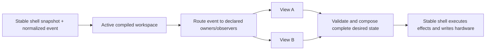

# Views API and Composite Workspaces

Status: design contract for working Core API 46 and checkpoint schema 6. The page ownership
refactor's integration package and exact-build `202arp` smoke are pending. Earlier baseline tests
and live checks do not certify this build. The remaining stable-adapter boundary is explicit in
claims and recorded in [`../ARCH.md`](../ARCH.md). The checkpoints below describe the composition
contract, not a claim that every inherited controller body has migrated.

## Goal

Make a controller view a reusable behavior with a fixed, inspectable Push 2 footprint. A workspace
combines views without allowing configuration to remap their behavior onto arbitrary controls.

The important rule is:

> A view decides where its behavior lives. A workspace may include a named facet, omit an optional
> facet, or explicitly replace an overlapping facet, but it cannot wire arbitrary behavior to raw
> hardware.

This keeps authored configurations useful without making them a second controller-programming
language. A bad composition should fail at compile time with both owners and the contested region,
not turn into order-dependent runtime behavior.

## Terms

- **Surface area**: a stable, named physical or rendered part of Push 2.
- **Claim**: one view's declared ownership of an area for input, output, or both.
- **View**: behavior plus a fixed set of required claims and named optional facets.
- **Facet**: a coherent optional part of a view, such as the upper Session scene keys. A facet has a
  fixed footprint; it is not a bag of freely assignable callbacks.
- **Workspace**: a named list of view profiles composed for one controller state.
- **Workspace compiler**: validates claims and produces one deterministic input/output owner table.
- **Stable shell**: owns Bitwig objects, MIDI/USB resources, callbacks, and effect execution.
- **Reloadable core**: owns view selection, composition, policy, and replayable desired state.

"Mode" and "view" in the inherited DrivenByMoss framework are implementation details during the
migration. Pull's model uses **view** for a fixed-footprint behavior and **workspace** for the active
composition. Session navigation and mixer controls are orthogonal views; there is no combined
Session/Mix super-view.

## Push 2 Areas

Areas are semantic and bounded. Grid coordinates use `(column, row)` with row 0 at the bottom, the
same orientation as Push 2 MIDI note layout.

```text
ENCODERS[0..7]             turns and touches
DISPLAY.PARAMETERS[0..7]   parameter name, value, and control graphics
DISPLAY.BOTTOM_STRIP[0..7] track/menu labels aligned to the lower soft keys
SOFT_KEYS.UPPER[0..7]      buttons above the display
SOFT_KEYS.LOWER[0..7]      buttons below the display
GRID.UPPER                 columns 0..7, rows 4..7
GRID.LOWER                 columns 0..7, rows 0..3
SCENE_KEYS.UPPER           four side keys aligned to GRID.UPPER
SCENE_KEYS.LOWER           four side keys aligned to GRID.LOWER
NAVIGATION.ARROWS          left, right, up, down
NAVIGATION.PAGE            page left and page right
NAVIGATION.OCTAVE          octave up and octave down
TOUCH_STRIP                touch and pitch/position data plus strip output mode
TRANSPORT.*                named transport controls, claimed individually
GLOBAL_MODIFIERS.*         Shift, Select, Delete, and similar controls
```

Smaller fixed subregions may be added when a real view proves the need. They must be named for a
stable physical footprint, not created ad hoc by a workspace. For example, the current drum-fill
view occupies the eight pads at columns 4..7 and rows 1..2 inside `GRID.LOWER`; four manually
mappable control pads occupy columns 4..7 on row 3. The fill view names its semantic action
endpoints and physical RGB endpoints separately while assigning both areas the same atomic
footprint. That lets direct fill routing keep stable semantic identities without hiding the actual
pad-light ownership or weakening overlap detection.

A claim declares both ownership and its current realization boundary. The Java API uses explicit
kinds equivalent to:

```java
record SurfaceClaim(SurfaceArea area, ClaimKind kind) {}

enum ClaimKind {
    OBSERVE_INPUT,
    EXCLUSIVE_INPUT,
    DIRECT_INPUT,
    STABLE_ADAPTER_INPUT,
    OUTPUT,
    STABLE_ADAPTER_OUTPUT
}
```

Multiple observers may coexist. There is exactly one owning input claim and one output claim for
any atomic area in a compiled workspace. The `STABLE_ADAPTER_*` kinds keep ownership in the view
graph while honestly recording that current shell mechanics still realize it; they require a
declared stable adapter facet. They are frozen migration-debt markers, not implementation choices
for new work. An adapter may preserve existing behavior only; a requested semantic change requires
a reusable canopy expansion and core policy.

A grid input claim includes the pad edge, its strike velocity, and per-pad pressure. Pressure is a
companion event for the same physical pad and follows the same compiled owner; it is never enabled
through a separate concrete-view registration list. A view may ignore pressure, and an unmapped
pad has no musical pressure destination. Aggregate channel pressure has no pad identity and remains
a distinct surface-wide input.

The stable shell captures those events and publishes the current typed pressure configuration and
drum base note. `DrumPlayPadView` owns RGB and pressure-to-MIDI policy for its fixed playable
footprint in both standalone and composite Drum layouts. Musical note edges still use the installed
built-in `NoteInput` translation; a view cannot yet declare arbitrary playable geometry. Both
stable adapters are inert for pressure.

## Fixed Views

A view exposes named profiles, not arbitrary ports:

```java
interface ControllerView {
    ViewId id();
    ViewProfile profile();
    void start(ControllerSnapshot snapshot);
    void reconcile(ControllerSnapshot snapshot);
    List<CoreEffect> handle(CoreEvent event, ControllerSnapshot snapshot);
    ViewOutput render(ControllerSnapshot snapshot);
}

record ViewProfile(
    ProfileId id,
    Set<SurfaceClaim> requiredClaims,
    Set<ControllerViewFacet> requiredControllerFacets,
    Map<FacetId, ViewFacet> optionalFacets,
    Set<FacetId> enabledFacets
) {}

record ViewFacet(
    FacetId id,
    Set<SurfaceClaim> claims,
    Set<ControllerViewFacet> controllerFacets
) {}
```

The code currently represents IDs as validated strings. The shape above is normative: fixed claims
live with the view, selected facets are part of the profile, and configurations may select only
facets that the view declares.

Examples:

- **Drum Controller** requires `GRID.LOWER`. Its lower half contains the 4x4 playable drum block,
  four momentary rate pads, eight fill pads, and four manually mappable control pads. A separate
  `RawPitchBendView` owns the touch strip. Drum Controller does not claim either scene-key group.
- **Session Clip Grid (upper)** requires `GRID.UPPER` and may claim `SCENE_KEYS.UPPER` as its named
  `scene-launch` facet.
- **Project Macro Controls** requires `ENCODERS`, `DISPLAY.PARAMETERS`, and encoder touches. It does
  not implicitly own the lower track strip.
- **Track Selection Strip** requires `DISPLAY.BOTTOM_STRIP` and `SOFT_KEYS.LOWER`.
- **Selected-track Mute/Solo** requires the dedicated Mute and Solo buttons and consumes the
  private authoritative selected-track snapshot. It is controller-level policy downstream of
  selection, not part of the selector, Session grid, or active display page.
- **Session Navigation** declares core input/output ownership of `NAVIGATION.ARROWS` for VS, plus
  explicit stable-adapter claims for the still-frozen page buttons. Other native pages use
  `NavigationView`; full Session over a legacy page declares `FrozenSessionArrowsView`. These
  profiles keep page buttons and sequencer navigation outside the four-arrow cutover.

## Physical edge ownership across page changes

`InputGestureRouter` belongs to one reloadable core generation and captures the exact receiver list
and semantic action owner at BEGIN. LONG and END return to that capture, including observers;
unknown/duplicate completions are inert. A new press resolves against the current composition.
The bounded capture set has capacity 256, matching the permanent Push input registry's bound.

A departing view remains alive until its last physical edge ends and any already-resolved deferred
action dispatches. Current and retained views reconcile in deterministic identity order; retained
views can request data, parameter banks and ticks. Only the current composition renders the display
and lights or declares new input routes. `ControllerView.parameterTouches(snapshot)` supplies the
narrow nonvisual exact-touch continuation, without rendering a hidden page. Last-release effects
retain their owner's declared data/bank dependencies through the result that submits those effects;
the following result can omit them.

The shell permits an offscreen touch lease only for an already-applied exact target whose exclusive
physical TOUCH still belongs to the active core generation. This grants no new route or target.
Generation disposal remains the cancellation path on failure/replacement; this does not introduce
an independent queued-action cancellation API or solve general host-operation quiescence.

Continuous events keep their existing transport policy. General encoder-touch/motion and
pad/pressure pairing is recorded in `findings/core-continuous-input-capture.md`; the edge guarantee
must not be described as a guarantee about every continuous input.

## Native musical ownership and parameter touches

API 46 separates native musical ownership from controller command and RGB ownership. A view that
returns an owned native key/velocity map, including a deliberately silent map, must declare its
`MUSICAL_INPUT` footprint. The parent value restricts enabled physical notes to Push pad notes
36–99; the compiler checks them against the same view's fixed claim and rejects conflicting musical
owners. A silent map is owned silence, while an unowned map releases the arbiter to the latest
cached legacy table. Map and layout changes wait for physical input to become idle. Applied-map
read-back means the shell successfully configured the native NoteInput table; it is not an
acknowledgement of any playback command.

Core returns the complete `DesiredParameterTouches` set. The shell retains exact bounded actuators,
releases omitted leases before effects, and acquires newly requested touches after effects so a
Delete reset precedes touch acquisition. `InputGestureRouter` sends END to the original view even
after its page departs. Mutable parameter identity is checked again at execution and cleanup; cleanup cannot
safely retarget an externally rebound proxy. Project Macro, Master, Track, Volume, and Pan own
complete touch semantics. The ordered `AcquireParameterTouchEffect` preserves a required
reset → touch → send-enable sequence while the complete desired touch set remains replayable.
The unified API 25 Automation Write property preserves stop-on-release policy; its historical
arranger-named native accessor is not evidence of a separate launcher write domain.

Named parameter snapshots include `ParameterTargetIdentitySnapshot(domain, ownerId, page, index)`
alongside the opaque actuator target. A Java proxy can stay the same while its semantic owner
changes. Volume/Pan require their current-bank row and parameter owner/domain to agree before
rendering, writing, or beginning a touch. A parameter-only reconciliation can precede the next
track-bank snapshot; that temporary disagreement is blank/inert. Existing exact lease cleanup
remains separate from eligibility to acquire or mutate the new current target.

## Workspace Compilation

A workspace is intentionally boring data:

```yaml
name: VS Live
session_bank:
  tracks: 8
  scenes: 4
views:
  - use: project-macro-controls
  - use: track-selection-strip
  - use: session-navigation
  - use: session-clip-grid-upper
    facets: [scene-launch]
  - use: drum-controller
  - use: raw-pitch-bend
```

The first implementation may construct this exact data in Java. YAML or JSON loading comes only
after the compiler and ownership diagnostics are stable.

`session_bank` is part of the workspace's fixed footprint, not a free mapping. The normal Session
view declares `8x8`; the current upper-grid Session profile declares `8x4`. The stable shell eagerly
installs only the deduplicated bank shapes declared by installed views and adapters. Core selects
among those banks as replayable workspace state, while stable switches the matching Bitwig proxy,
preserves track/scene offsets, and gives only that proxy clip-launcher feedback. A core requesting an
undeclared shape is rejected before activation; adding a new shape requires a shell build and Bitwig
restart, while selecting or composing already installed shapes remains core-reloadable.

Compilation rules:

1. Expand each selected profile and facet into atomic claims.
2. Permit shared `OBSERVE` input claims.
3. Reject overlapping exclusive-input or output claims by default.
4. Permit replacement only through an explicit, named overlay rule that identifies the displaced
   facet and replacement facet.
5. Produce deterministic input and output ownership tables independent of declaration order.
6. Validate required shell capabilities before activation.
7. Validate that the declared Session bank shape matches the fixed Session adapter footprint.

V1 has no dynamic negotiation. V2 may allow a workspace to enable or disable named optional facets
based on capabilities, but a view's remaining footprint still cannot move.

## Runtime Flow



Activation is transactional. The candidate workspace compiles and renders a complete initial
result before it replaces the active workspace. Reload captures the active workspace ID and view
state in the checkpoint envelope. A rejected candidate leaves the prior generation active.

Page and grid selection are independent. `ControllerPageCompositions` compiles the finite declared
page/background pairs once, retaining the actual Session/Drum/Note/ribbon view instances and their
fixed claims. A page replacement changes only encoder, row, and display ownership. It never selects
a different Bitwig track merely to activate an inherited display mode.

`Page` is an immutable core definition: a `PageId`, fixed constituent `ControllerView` objects,
optional navigation view, and declared parameter-indication slots. `PageNavigation` owns runtime
selection/history separately. The compiled catalog chooses the page's views over an independent
musical background; a background that already owns arrows omits the optional page navigation.
Legacy aliases live in `LegacyPageAliases`, outside the definition and rendering model. A new
`PageId` requires no parent-loaded enum, registered shell mode, or page-specific facade.

The complete replayable `DesiredControllerState.page` contains selected/previous references, one
optional temporary page token, revision, legacy-request acknowledgement and indications. References
are CORE (opaque ID), LEGACY (explicit installed body) or NONE. An unchanged projection causes no
lifecycle churn. Core page changes commit after semantic-action admission; they do not await host
mode acknowledgement. Bitwig state and musical-route acknowledgement remain independent barriers.
`ControllerLayoutSnapshot` mode fields are compatibility/debug projection, not navigation authority.

`PushControllerPageManager` realizes any CORE ID through one inert adapter. Its frozen enum aliases
support existing callers without owning history. Legacy mutations enter a 64-entry contiguous
inbox carrying page revision and temporary token. Core resolves each request once, routes it through
ACTIVE_PARAMETERS restoration, applies same-origin batches in order, rejects stale batches, and
acknowledges only the dispatched prefix. Exact captured page references support returns to IDs with
no legacy alias. A new temporary owner invalidates an old owner's return even when both use the
same page name. Captured legacy holds pair BEGIN and END by initiating request sequence; END
releases only the resulting exact core token, while CANCEL retires the handle without changing
the page. Toggle requests are reduced in core, so two presses before projection still open and
close in order. Conditional entry (the inherited Shift/Scales hold) cannot initiate parameter
restoration while its required page is absent. It stays ordered behind an earlier deferred action
and rechecks the condition at dispatch. Physical gesture state never crosses a core replacement.

Projection publishes the new state before lifecycle callbacks. Old-body deactivation requests keep
the old origin; new-body activation requests use the new origin. Callbacks enqueue only and cannot
synchronously recurse through the runtime. Pending inbox entries, notifications and projection
fence replacement while a healthy consumer exists. Captured temporary-request handles also fence
healthy replacement; their once-only close retains the initiating request identity. Fault cleanup
retires those handles and callbacks. Projection tracks visible state separately from the body that
actually entered, preventing reentrant cleanup from activating an unentered legacy destination.
Generic parameter indications come from declared slots and exact live targets; outgoing indication
ownership is published and released before a legacy activation callback, and refresh cannot revive
that retired ownership. These are not Master-specific shell policies.

The inbox carries a monotonic parent-owned `retiredSequence` as well as its bounded pending suffix.
It includes acknowledged and abandoned requests. Core startup rebases its acknowledgement from
this prefix even when a checkpoint is incompatible or discarded. The prefix is lifecycle metadata,
available without host sampling even when `CONTROLLER_PAGES` is unrequested; only pending request
publication is subscription-gated. An absent healthy consumer cannot accept new callback requests.
Generation replacement and quarantine retire delayed callback epochs. This is a bounded page-inbox
recovery protocol, not a replacement for the parked general quiescence work.

`BROWSER` supplies raw `BrowserSnapshot` activity with a transition generation. Core's
`BrowserPageNavigation` owns temporary Browser entry/return through the same parameter barrier.
It reconciles newer observations before executing deferred requests, so open-then-close before
admission cannot create a stale Browser page. Return requires its exact temporary token, which a
healthy replacement recovers from the checkpointed desired page. The raw observation stores only
one latest state and a monotonic transition generation, not an unbounded event log. Browser
search, selection and commit/cancel bodies remain frozen legacy behavior.

Session and Note selection choose their default Track page and a grid destination independently.
Grid handoff retires only after a later generation reports the requested grid; it never waits for
TRACK mode. Note-route neutralization cannot select a page. Legacy Device/Browser and other
unmigrated bodies retain their reviewed behavior under explicit LEGACY references. Relinquishing
workspace facets changes grid ownership; it does not consult an inherited page history.

Feature views project authoritative data and controller-local state into typed immutable models
in `de.mossgrabers.pull.core.ui.page`. Family renderers consume those models and `PageStyle` plus
family styles, returning only `PageVisuals` (scene and row lights). Input policy, target resolution,
identity alignment, effects and touch ownership stay in feature views. Renderers perform no host
lookup, navigation, effect emission or parameter acquisition. This separation covers Macro,
Track, Master, Volume/Pan/Send, Accent, Frame and transport/automation pages; shared drawing
primitives preserve their established layout without a universal configurable UI schema.

Stop-plus-track is an installed Session-bank action. The row owner captures the exact bank
generation, shape, index, and channel identity at `BEGIN`; stable revalidates that identity at apply
time and stops the track without selecting it. Full Session also mechanically consumes the bounded
stable lower-row release. Both paths consume the shared Stop gesture so release cannot become a
plain selected-track Stop.

Page and Master overlays reuse retained instances of the underlying grid views. A compiled overlay
may start independently, but it reconciles an already-started retained view instead of restarting
it, so held-pad and other BEGIN-to-END state survives the page replacement.

Master is resolved from the exact selected composition, not only its top-level workspace ID. Its
page therefore retains standalone Drum views and mapping leases, full Session and Stop ownership,
selected Note routing, or the VS Live grid views actually active when Master was entered.

Hydration restores exact page references and history from schema 6. When no checkpoint is
available, the frozen initial layout alias supplies the starting page. Later mode projection does
not override that core state. The persistent Session grid composes around the selected page.

Controller-level selected-track Mute/Solo remains composed through every such page replacement.
Its exclusive input and RGB output claims are unaffected by Session, Mix, Device, Browse, Master,
or composite-grid selection. Legacy page-retarget and held-modifier meanings were removed; a view
which needs a future target other than the selected track must declare a different target-specific
control view rather than infer it from the visible page.

Mute, Solo, Record-arm, and launcher-overdub toggles retain one bounded pending lane per semantic
property. Repeated presses collapse to parity while an absolute request awaits host read-back; a
dependent request is emitted only after a later authoritative snapshot acknowledges the previous
expected state. A target/project change retires the lane.

Display fragments now follow the same ownership rule for the installed VS Live page. Project Macro
or Track Mixer emits only a local 960x143 `DISPLAY.PARAMETERS` scene, while Track Selection emits only a local
960x17 `DISPLAY.BOTTOM_STRIP` scene. The compiler rejects a partial page, an unclaimed fragment, an
overlap with a complete-scene owner, or a primitive outside its local viewport; successful
composition wraps each fragment in a compiler-owned, renderer-enforced clip and yields one 960x160
base scene. The shell's generic base plane replaces inherited page
columns without suppressing ordinary overlays. A temporary display overlay is different: for
example, a short-lived full-screen status/animation scene sits above the composed base and then
reveals it again, rather than sharing either region claim.

The retained Track Selection footer consumes the bounded Session bank's semantic track type as
well as its name, color, activation, and selection state. Its colors, selection contrast, inactive
dimming, two-pixel column gap, and channel icon are core-owned parity policy. Project Macro likewise
owns the legacy parameter visual semantics in its region: subdued teal parameters brighten on
touch, Boolean values use toggle pills, and the old adapter's non-rendered `Project` menu text is
not invented as a visible title.

When VS Live selects Track/Mix, `TrackMixerControlsView` replaces only the 960x143 producer.
It declares named `SELECTED_TRACK` and `SELECTED_TRACK_SENDS` banks and owns encoder turns,
touches, Mix/I-O selection, send paging, send enable, and upper-row feedback. Its fixed physical
claims remain unchanged while `parameterBindings(snapshot)` selects volume/pan and six send
slots for the current subpage; the compiler validates every result against the declared controls
and banks. Missing read-back does not select a different subpage. The retained VS Track Selection
footer remains the independent 960x17 producer.

Ordinary Track composes the same body with `CurrentTrackFooterView`, which reads the current
main/effect bank independently from Session. Its lower row preserves release-time modifiers,
parent navigation, selected-group entry, and device-page selection. Record chord consumption is
shared with the global core Record gesture. Normal encoder response preserves configured
sensitivity, volume acceleration, and pan centering; VS Live retains its established response.
Track subpage and send offset survive core checkpoints, as does semantic parameter-page selection.


VS Live page selection commits through core navigation after parameter-restoration admission.
Mechanical Note-route changes carry no page-selection intent. A deferred page action retains the
old page until admission, then selects locally. Shift+Session reselects the declared composite and
its Project Macro default even when VS Live was already active on another page. For named Track
banks, stable validates model cursor and current-bank owner against the private selection-following
cursor before publishing a slot. The removed Track provider no longer chooses core parameter
identity or response.

Normal Volume/Pan pages compose `GlobalMixerControlsView` with the same current-bank footer.
Their named eight-track banks, configured encoder response, Delete/touch/automation behavior,
upper menus, display, and lower-row feedback are core-owned. `ControllerSettingsSnapshot` supplies
observed VU preference, remembered global-mix mode, send-menu offset, and bounded cursor-send
metadata. Typed absolute settings effects execute in stable; the core decides every menu action.
Send 1–8 use the same core family with named send banks. Crossfade and device bodies remain legacy.

`TrackMixControlView` owns the global Track/Mix button, including modifier preference changes,
entry, held return, and light policy. `MetronomeControlView` and `AutomationControlView` retain their
global gesture state across page replacement; transport/automation option pages render observed
settings and use typed requests. `MasterButtonView` handles Master/Frame entry and restoration over
the exact composition, including Browser guards and deferred semantic admission. `FramePageView` owns
all option rows, copy, layout, and lights. `ApplicationUiSnapshot` contains the native panel layout,
seven Arranger flags, six Mixer flags, and an exact project/layout context. Native visibility
values stay interested; unrequested APPLICATION_UI does no DTO sampling and publishes typed empty.
Observed flags use absolute setters with later read-back. Native panel toggles lacking visibility
read-back retain ordinary unselected feedback rather than inventing a selected state.

Four-arrow policy is core-owned for core pages and every VS page. Track/Volume/Pan
use plain horizontal track-page movement and Shift cursor swap; other core pages have inert
horizontal actions. Vertical arrows use current-bank scene step or Shift scene page. VS horizontal
arrows use track page or Shift track step. Availability controls light output, not whether a valid
press submits an operation. Left/right retain the parameter-restoration action barrier. The
separate navigation generation fences current track/scene window, project, cursor ID/pin/position,
and exact prepared actuators. Full Session with a legacy page retains frozen arrow policy, and
page/sequencer buttons are unchanged.

Master's own previous/next project action retains its local page revision across the resulting
project observations. Later target-project read-back updates the retained scene; an explicit page
or workspace change retires that retention. DAW Master selection is reduced by
`MasterTrackPageNavigation` in core, separate from the shell's raw Master selection observation.

Working API 46 capability versions are bridge snapshot 14, controller output state 4 and controller
pages 1. Parameter targets remain 4, input routing 7, current-track effects 2, transport effects 4,
controller-settings effects 1 and application-UI effects 1. Schema 6 stores exact page references,
history and latched temporary ownership alongside Track Mix/I-O/send and playback-owner state.
Its stored request acknowledgement is rebased from the shell retired prefix at every startup. It
never serializes executable continuations or a partially held physical
gesture. Session grid/scene actions and their release contract remain open; optional SESSION_CLIPS
observation and migrated arrows do not complete Session launch migration.

## Implementation Checkpoints

### Checkpoint 1: Behavior-Preserving View Runtime

Introduce the fixed-footprint model and workspace compiler inside the reloadable core. Move the
currently migrated behavior through views:

- Drum-fill matching, launch ownership, and eight pad lights become one fixed drum-fill view.
- A selected track's allocated bank of four detached semantic absolute controls owns the remaining
  row's Bitwig-learned actions and raw mapped-target presence/value feedback. Core retains that
  view's complete fenced physical-to-semantic lease and next minimum/maximum value. API 44
  installs 128 such banks; allocation and persistence acknowledgement follow the bounded V1
  contract in `../pull-core-api/src/main/java/de/mossgrabers/pull/core/api/CONTROLLER_MAPPING_IDENTITY.md`.
  All 64 original physical PAD buttons remain ordinary-dispatch-only and never define learned
  identity. Permanent raw MIDI triggers those established objects outside a mapping lease; inside
  one it supplies the normalized core gesture independently of the one semantic learned action.
  Core owns the midpoint, next-endpoint, and red/off policy derived from later authoritative
  presence/value feedback keyed by semantic endpoint; stable code does not interpret the value.
- Record, Shift + Record, and Select + Record become one fixed Record control view.
- The selected Drum workspace composes those views; melodic Note workspaces do not retain a hidden
  drum-fill owner.
- Existing `CoreResult` output, input routes, bridge subscriptions, clip bindings, effects,
  reload semantics, and hardware behavior remain byte-for-byte or value-for-value equivalent.

Offline tests must retain all current behavior cases and add compiler tests for conflicting output,
exclusive input, shared observers, and declaration-order independence. Commit this checkpoint
before adding `VS Live`; it is the rollback point for the first Bitwig/Push smoke test.

### Checkpoint 2: `VS Live` Composite

Add one hardcoded workspace named `VS Live`, entered with **Shift + Session** for now:

- Project Macro Controls own the eight top encoders, their touches, and parameter display, matching
  the current Project side of User mode.
- Track Selection Strip owns the lower display strip and lower soft keys so visible tracks can be
  selected directly.
- Session Navigation owns arrow input/feedback while retaining the declared frozen Session page
  buttons, so page replacements preserve both surfaces without claiming their migration complete.
- Session Clip Grid owns the upper four pad rows. Clip launch behavior and scene order match Session
  view through its declared `8x4` Session bank rather than an `8x8` bank cropped at render time.
- Drum Controller owns the bottom four pad rows, including its existing 4x4 playable block, rate
  pads, and fill pads. Separate fixed views implement those subregions: `DrumPlayPadView` for
  playable feedback and pressure, `DrumRateView` for rate/roll policy, and `DrumFillView` for fills.
- A separately composed `RawPitchBendView` owns raw strip input, mode, value, and release behavior.
  Its retained gesture keeps the route selected at BEGIN through END even if the page changes.

- Per-pad pressure on Drum Controller's playable 4x4 block follows that same lower-grid ownership;
  pressure on rate, fill, and Session pads has no musical destination.
- `DrumPlayPadView` implements that policy in both standalone and composite layouts. It observes the
  playable pad edges and pressure, honors Off/Poly/Channel/CC configuration, and sends mapped output
  through the permanent NoteInput MIDI effect. Neither stable view performs parallel pressure
  mutation or playable-pad rendering.
- No view claims the lower scene keys merely because they sit beside Drum Controller. Upper scene
  keys may launch the four visible Session scenes through the Session grid's named facet.

The first version is deliberately a Java-defined configuration and a hardcoded entry gesture. It
proves that fixed views compose correctly before configuration parsing or dynamic negotiation is
added.

Plain **Session** exits through an explicit destination workspace containing the Track/Mix page and
the complete `8x8` Session view. **Note** enters a controller-level core view that resolves the
selected track's target-fenced preference and applicability to one bounded installed note view.
Core holds the destination until controller-layout read-back acknowledges the requested stable
grid/view; command submission alone does not release musical ownership. Stable code must not infer the
view from a pinnable cursor, force the workspace from generic mode/view listeners, or recover a
destination from previous-mode history.

The same controller-level Note view owns Layout-button input. Normal and Shift cycles update the
selected track's fenced preference and flow through the composed Note lifecycle; a track-selection
observer must never activate a preferred view independently. Page and grid are separate outputs:
changing the Note layout may update the underlying grid without dismissing a Scale, Device, or
other stable page overlay.

The four rate pads are a complete core-owned semantic slice. Their edge routes and RGB feedback are
exclusive while Drum Controller is engaged, and the output includes a replayable desired
note-repeat state. Stable only reads the installed Repeat engine, applies the bounded request, and
restores the pre-ownership manual state after later read-back. Disabling **Automatic arp / roll**
releases that lease and blanks the rate pads without changing note-view policy.

The original checkpoint introduced complete `DesiredControllerWorkspace` values with a name and
known fixed-facet IDs. API 46 separates its grid/facet selection from `DesiredControllerState.page`;
there is no installed-mode field or controller-mode effect in the page path. `VS Live`, its selected
views/facets, conflict-free composition and Shift+Session selection live in reloadable core.
Stable contains reusable adapters for facet mechanics that still depend on the inherited object
graph. It must not branch on the name `VS Live`. As those remaining capabilities migrate, adapters
can be replaced without redesigning page identity, presentation or workspace configuration.

The Bitwig smoke test checks:

1. Existing startup and ordinary Session/Drum/User behavior still work.
2. Shift + Session enters `VS Live` without a stuck Shift gesture.
3. Encoders edit project macros and the display reflects authoritative values.
4. Lower soft keys select the tracks named in the bottom strip.
5. Arrow keys navigate the Session bank.
6. Upper pads launch the expected four scenes; lower pads play drums/rates/fills only.
7. Pitch bend reaches the selected drum track and releases cleanly.
8. Strike velocity and pressure produce the same drum-note behavior as standalone Drum Controller.
9. Plain Session and Note leave the workspace through their ordinary destinations; re-entry
   restores composite ownership and note mapping.
10. Moving from a melodic track to a drum target while Note is visible selects Drum Controller
    after authoritative drum applicability arrives; moving back selects the track's melodic view.
11. Automatic roll is present only while Drum Controller owns the rate pads, its lights follow
    Repeat read-back, and leaving or disabling it retires Repeat while restoring the prior manual
    parameters.

Commit the composite separately so a hardware failure can be bisected to either the view-runtime
migration or the `VS Live` shell integration.

## Deferred Work

- YAML/JSON configuration loading and schema versioning.
- Capability-driven optional-facet negotiation.
- Complete remaining display and light ownership in the stable Core API. Until each surface
  migrates, its inherited stable renderer is frozen and may not receive new semantics.
- Migrating every inherited DrivenByMoss mode/view family.
- User-authored overlays beyond named, statically validated replacements.
- Persisting richer per-view navigation state across reload.
- Arbitrary core-authored musical pad geometry; see
  [`findings/custom-musical-surface-geometry.md`](findings/custom-musical-surface-geometry.md).
- A bidirectional compiler contract between every stable facet and its exact stable claims; see
  [`findings/stable-facet-claim-coupling.md`](findings/stable-facet-claim-coupling.md).
