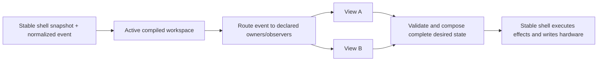

# Views API and Composite Workspaces

Status: design contract. Checkpoints 1 and 2 are structurally implemented through Core API 41. The
remaining stable-adapter boundary is represented explicitly in claims and recorded in
[`../ARCH.md`](../ARCH.md). The checkpoints remain below so code, offline tests, and Push hardware
tests can be compared against the intended end state.

## Goal

Make a controller view a reusable behavior with a fixed, inspectable Push 2 footprint. A workspace
combines views without allowing configuration to remap their behavior onto arbitrary controls.

The important rule is:

> A view decides where its behavior lives. A workspace may include a named facet, omit an optional
> facet, or explicitly replace an overlapping facet, but it cannot wire arbitrary behavior to raw
> hardware.

This keeps authored configurations useful without making them a second controller-programming
language. A bad composition should fail at compile time with both owners and the contested region,
not turn into order-dependent runtime behavior.

## Terms

- **Surface area**: a stable, named physical or rendered part of Push 2.
- **Claim**: one view's declared ownership of an area for input, output, or both.
- **View**: behavior plus a fixed set of required claims and named optional facets.
- **Facet**: a coherent optional part of a view, such as Drum Controller pitch bend. A facet has a
  fixed footprint; it is not a bag of freely assignable callbacks.
- **Workspace**: a named list of view profiles composed for one controller state.
- **Workspace compiler**: validates claims and produces one deterministic input/output owner table.
- **Stable shell**: owns Bitwig objects, MIDI/USB resources, callbacks, and effect execution.
- **Reloadable core**: owns view selection, composition, policy, and replayable desired state.

"Mode" and "view" in the inherited DrivenByMoss framework are implementation details during the
migration. Pull's model uses **view** for a fixed-footprint behavior and **workspace** for the active
composition. Session navigation and mixer controls are orthogonal views; there is no combined
Session/Mix super-view.

## Push 2 Areas

Areas are semantic and bounded. Grid coordinates use `(column, row)` with row 0 at the bottom, the
same orientation as Push 2 MIDI note layout.

```text
ENCODERS[0..7]             turns and touches
DISPLAY.PARAMETERS[0..7]   parameter name, value, and control graphics
DISPLAY.BOTTOM_STRIP[0..7] track/menu labels aligned to the lower soft keys
SOFT_KEYS.UPPER[0..7]      buttons above the display
SOFT_KEYS.LOWER[0..7]      buttons below the display
GRID.UPPER                 columns 0..7, rows 4..7
GRID.LOWER                 columns 0..7, rows 0..3
SCENE_KEYS.UPPER           four side keys aligned to GRID.UPPER
SCENE_KEYS.LOWER           four side keys aligned to GRID.LOWER
NAVIGATION.ARROWS          left, right, up, down
NAVIGATION.PAGE            page left and page right
NAVIGATION.OCTAVE          octave up and octave down
TOUCH_STRIP                touch and pitch/position data plus strip output mode
TRANSPORT.*                named transport controls, claimed individually
GLOBAL_MODIFIERS.*         Shift, Select, Delete, and similar controls
```

Smaller fixed subregions may be added when a real view proves the need. They must be named for a
stable physical footprint, not created ad hoc by a workspace. For example, the current drum-fill
view occupies the eight pads at columns 4..7 and rows 1..2 inside `GRID.LOWER`; four manually
mappable control pads occupy columns 4..7 on row 3. The fill view names its semantic action
endpoints and physical RGB endpoints separately while assigning both areas the same atomic
footprint. That lets direct fill routing keep stable semantic identities without hiding the actual
pad-light ownership or weakening overlap detection.

A claim declares both ownership and its current realization boundary. The Java API uses explicit
kinds equivalent to:

```java
record SurfaceClaim(SurfaceArea area, ClaimKind kind) {}

enum ClaimKind {
    OBSERVE_INPUT,
    EXCLUSIVE_INPUT,
    DIRECT_INPUT,
    STABLE_ADAPTER_INPUT,
    OUTPUT,
    STABLE_ADAPTER_OUTPUT
}
```

Multiple observers may coexist. There is exactly one owning input claim and one output claim for
any atomic area in a compiled workspace. The `STABLE_ADAPTER_*` kinds keep ownership in the view
graph while honestly recording that current shell mechanics still realize it; they require a
declared stable adapter facet. They are frozen migration-debt markers, not implementation choices
for new work. An adapter may preserve existing behavior only; a requested semantic change requires
a reusable canopy expansion and core policy.

A grid input claim includes the pad edge, its strike velocity, and per-pad pressure. Pressure is a
companion event for the same physical pad and follows the same compiled owner; it is never enabled
through a separate concrete-view registration list. A view may ignore pressure, and an unmapped
pad has no musical pressure destination. Aggregate channel pressure has no pad identity and remains
a distinct surface-wide input.

The stable shell captures those events and publishes the current typed pressure configuration and
drum base note. `DrumPlayPadView` owns RGB and pressure-to-MIDI policy for its fixed playable
footprint in both standalone and composite Drum layouts. Musical note edges still use the installed
built-in `NoteInput` translation; a view cannot yet declare arbitrary playable geometry. Both
stable adapters are inert for pressure.

## Fixed Views

A view exposes named profiles, not arbitrary ports:

```java
interface ControllerView {
    ViewId id();
    ViewProfile profile();
    void start(ControllerSnapshot snapshot);
    void reconcile(ControllerSnapshot snapshot);
    List<CoreEffect> handle(CoreEvent event, ControllerSnapshot snapshot);
    ViewOutput render(ControllerSnapshot snapshot);
}

record ViewProfile(
    ProfileId id,
    Set<SurfaceClaim> requiredClaims,
    Set<ControllerViewFacet> requiredControllerFacets,
    Map<FacetId, ViewFacet> optionalFacets,
    Set<FacetId> enabledFacets
) {}

record ViewFacet(
    FacetId id,
    Set<SurfaceClaim> claims,
    Set<ControllerViewFacet> controllerFacets
) {}
```

The code currently represents IDs as validated strings. The shape above is normative: fixed claims
live with the view, selected facets are part of the profile, and configurations may select only
facets that the view declares.

Examples:

- **Drum Controller** requires `GRID.LOWER`. Its lower half contains the 4x4 playable drum block,
  four momentary rate pads, eight fill pads, and four manually mappable control pads. Its named `pitch-bend` facet claims
  `TOUCH_STRIP`. It does not claim either scene-key group.
- **Session Clip Grid (upper)** requires `GRID.UPPER` and may claim `SCENE_KEYS.UPPER` as its named
  `scene-launch` facet.
- **Project Macro Controls** requires `ENCODERS`, `DISPLAY.PARAMETERS`, and encoder touches. It does
  not implicitly own the lower track strip.
- **Track Selection Strip** requires `DISPLAY.BOTTOM_STRIP` and `SOFT_KEYS.LOWER`.
- **Selected-track Mute/Solo** requires the dedicated Mute and Solo buttons and consumes the
  private authoritative selected-track snapshot. It is controller-level policy downstream of
  selection, not part of the selector, Session grid, or active display page.
- **Session Navigation** currently requires `NAVIGATION.ARROWS` and `NAVIGATION.PAGE` because the
  installed stable adapter realizes them together. Page navigation may become optional only after
  the shell exposes it as an independently selectable facet.

## Workspace Compilation

A workspace is intentionally boring data:

```yaml
name: VS Live
session_bank:
  tracks: 8
  scenes: 4
views:
  - use: project-macro-controls
  - use: track-selection-strip
  - use: session-navigation
  - use: session-clip-grid-upper
    facets: [scene-launch]
  - use: drum-controller
    facets: [pitch-bend]
```

The first implementation may construct this exact data in Java. YAML or JSON loading comes only
after the compiler and ownership diagnostics are stable.

`session_bank` is part of the workspace's fixed footprint, not a free mapping. The normal Session
view declares `8x8`; the current upper-grid Session profile declares `8x4`. The stable shell eagerly
installs only the deduplicated bank shapes declared by installed views and adapters. Core selects
among those banks as replayable workspace state, while stable switches the matching Bitwig proxy,
preserves track/scene offsets, and gives only that proxy clip-launcher feedback. A core requesting an
undeclared shape is rejected before activation; adding a new shape requires a shell build and Bitwig
restart, while selecting or composing already installed shapes remains core-reloadable.

Compilation rules:

1. Expand each selected profile and facet into atomic claims.
2. Permit shared `OBSERVE` input claims.
3. Reject overlapping exclusive-input or output claims by default.
4. Permit replacement only through an explicit, named overlay rule that identifies the displaced
   facet and replacement facet.
5. Produce deterministic input and output ownership tables independent of declaration order.
6. Validate required shell capabilities before activation.
7. Validate that the declared Session bank shape matches the fixed Session adapter footprint.

V1 has no dynamic negotiation. V2 may allow a workspace to enable or disable named optional facets
based on capabilities, but a view's remaining footprint still cannot move.

## Runtime Flow



Activation is transactional. The candidate workspace compiles and renders a complete initial
result before it replaces the active workspace. Reload captures the active workspace ID and view
state in the checkpoint envelope. A rejected candidate leaves the prior generation active.

The stable adapter realizes page and grid facets as independent leases. A page overlay such as
Master may replace the encoder/display page while retaining the selected workspace's grid facets;
it must not select a different Bitwig track merely to activate the inherited display mode.
Transitions back to stable layouts are also views, not shell history: the Session destination
temporarily composes `TrackMixerPageView` with `SessionView.full()`, and Note compiles
`TrackMixerPageView` around the core-owned target-fenced Note viewer. Core holds destination page
facets until the authoritative layout snapshot reports the requested mode/view. It then releases
only the acknowledged page while retaining `SessionView`, including its grid and Stop Clip
ownership. Likewise, a composite may release its default parameter/display page after read-back
while retaining disjoint grid/button views. An empty workspace therefore means only "release every
core facet"; it does not choose or restore a destination.

Stop-plus-track is an installed Session-bank action. The row owner captures the exact bank
generation, shape, index, and channel identity at `BEGIN`; stable revalidates that identity at apply
time and stops the track without selecting it. Full Session also mechanically consumes the bounded
stable lower-row release. Both paths consume the shared Stop gesture so release cannot become a
plain selected-track Stop.

Page and Master overlays reuse retained instances of the underlying grid views. A compiled overlay
may start independently, but it reconciles an already-started retained view instead of restarting
it, so held-pad and other BEGIN-to-END state survives the page replacement.

Master is resolved from the exact selected composition, not only its top-level workspace ID. Its
page therefore retains standalone Drum views and mapping leases, full Session and Stop ownership,
selected Note routing, or the VS Live grid views actually active when Master was entered.

Hydration requests Session's default Track/Mix page only when page state is genuinely unavailable.
If Mix, Device, or Browse is already authoritative, core retains that page and composes the
persistent Session view around it.

Controller-level selected-track Mute/Solo remains composed through every such page replacement.
Its exclusive input and RGB output claims are unaffected by Session, Mix, Device, Browse, Master,
or composite-grid selection. Legacy page-retarget and held-modifier meanings were removed; a view
which needs a future target other than the selected track must declare a different target-specific
control view rather than infer it from the visible page.

Mute, Solo, Record-arm, and launcher-overdub toggles retain one bounded pending lane per semantic
property. Repeated presses collapse to parity while an absolute request awaits host read-back; a
dependent request is emitted only after a later authoritative snapshot acknowledges the previous
expected state. A target/project change retires the lane.

Display fragments now follow the same ownership rule for the installed VS Live page. Project Macro
or Track Mixer emits only a local 960x143 `DISPLAY.PARAMETERS` scene, while Track Selection emits only a local
960x17 `DISPLAY.BOTTOM_STRIP` scene. The compiler rejects a partial page, an unclaimed fragment, an
overlap with a complete-scene owner, or a primitive outside its local viewport; successful
composition wraps each fragment in a compiler-owned, renderer-enforced clip and yields one 960x160
base scene. The shell's generic base plane replaces inherited page
columns without suppressing ordinary overlays. A temporary display overlay is different: for
example, a short-lived full-screen status/animation scene sits above the composed base and then
reveals it again, rather than sharing either region claim.

The retained Track Selection footer consumes the bounded Session bank's semantic track type as
well as its name, color, activation, and selection state. Its colors, selection contrast, inactive
dimming, two-pixel column gap, and channel icon are core-owned parity policy. Project Macro likewise
owns the legacy parameter visual semantics in its region: subdued teal parameters brighten on
touch, Boolean values use toggle pills, and the old adapter's non-rendered `Project` menu text is
not invented as a visible title.

When VS Live selects Track/Mix, `TrackMixerControlsView` replaces only the 960x143 producer. It
declares the installed `ACTIVE` parameter bank, owns all eight relative encoder turns and their
typed effects, and renders the selected track's Volume/Pan plus active send slots from authoritative
read-back. Missing parameter slots render blank inside the still-selected Mix view; data absence is
never interpreted as selection of the inherited Input & Output page. The retained Track Selection
footer remains the independent 960x17 producer. Encoder
touches and the inherited upper-row page menu remain explicit frozen adapters; ordinary Track/Mix
outside this composition is not implied to have migrated.

VS Live page selection advances only from the semantic action emitted by a stable page command.
The controller-state host may temporarily report `TRACK` while it neutralizes and reattaches a
selected-track Note route; that mechanical layout read-back carries no page-selection intent and
cannot replace Project Macro with Track/Mix. If snapback defers the stable command, core retains
the old page until a later layout generation acknowledges the released action. Shift+Session is
an idempotent selection of the declared composite and therefore always reselects Project Macro,
even when VS Live was already active on Track/Mix or another replaceable page. For the inherited
Mix compatibility window, stable
unwraps Volume/Pan's mechanical response-curve adapters, validates the real bound parameters
against the selected current-bank track, and then requires its channel ID to agree with the private
selection-following cursor before publishing any slot.

Master's own previous/next project action creates a bounded page-retention lease. The lease is tied
to the workspace-request sequence and survives both intermediate and late stable layout resets.
Later target-project read-back updates the retained scene without silently changing pages; an
explicit page or workspace request retires the lease.

## Implementation Checkpoints

### Checkpoint 1: Behavior-Preserving View Runtime

Introduce the fixed-footprint model and workspace compiler inside the reloadable core. Move the
currently migrated behavior through views:

- Drum-fill matching, launch ownership, and eight pad lights become one fixed drum-fill view.
- Four detached semantic hardware buttons own the remaining row's Bitwig-learned actions and
  background-light feedback while core retains that view's complete physical-to-semantic lease.
  All 64 original physical PAD buttons remain ordinary-dispatch-only and never define learned
  identity. Permanent raw MIDI triggers those established objects outside a mapping lease; inside
  one it supplies the normalized core gesture independently of the one semantic learned action.
  Core owns red/off policy derived from later authoritative feedback keyed by semantic endpoint.
- Record, Shift + Record, and Select + Record become one fixed Record control view.
- The selected Drum workspace composes those views; melodic Note workspaces do not retain a hidden
  drum-fill owner.
- Existing `CoreResult` output, input routes, bridge subscriptions, clip bindings, effects,
  reload semantics, and hardware behavior remain byte-for-byte or value-for-value equivalent.

Offline tests must retain all current behavior cases and add compiler tests for conflicting output,
exclusive input, shared observers, and declaration-order independence. Commit this checkpoint
before adding `VS Live`; it is the rollback point for the first Bitwig/Push smoke test.

### Checkpoint 2: `VS Live` Composite

Add one hardcoded workspace named `VS Live`, entered with **Shift + Session** for now:

- Project Macro Controls own the eight top encoders, their touches, and parameter display, matching
  the current Project side of User mode.
- Track Selection Strip owns the lower display strip and lower soft keys so visible tracks can be
  selected directly.
- Session Navigation owns the arrow keys (and established Session paging behavior) so track/scene
  navigation remains available.
- Session Clip Grid owns the upper four pad rows. Clip launch behavior and scene order match Session
  view through its declared `8x4` Session bank rather than an `8x8` bank cropped at render time.
- Drum Controller owns the bottom four pad rows, including its existing 4x4 playable block, rate
  pads, and fill pads. Separate fixed views implement those subregions: `DrumPlayPadView` for
  playable feedback and pressure, `DrumRateView` for rate/roll policy, and `DrumFillView` for fills.
- Drum Controller's `pitch-bend` facet owns the touch strip.
- Per-pad pressure on Drum Controller's playable 4x4 block follows that same lower-grid ownership;
  pressure on rate, fill, and Session pads has no musical destination.
- `DrumPlayPadView` implements that policy in both standalone and composite layouts. It observes the
  playable pad edges and pressure, honors Off/Poly/Channel/CC configuration, and sends mapped output
  through the permanent NoteInput MIDI effect. Neither stable view performs parallel pressure
  mutation or playable-pad rendering.
- No view claims the lower scene keys merely because they sit beside Drum Controller. Upper scene
  keys may launch the four visible Session scenes through the Session grid's named facet.

The first version is deliberately a Java-defined configuration and a hardcoded entry gesture. It
proves that fixed views compose correctly before configuration parsing or dynamic negotiation is
added.

Plain **Session** exits through an explicit destination workspace containing the Track/Mix page and
the complete `8x8` Session view. **Note** enters a controller-level core view that resolves the
selected track's target-fenced preference and applicability to one bounded installed note view.
Core holds the destination until controller-layout read-back acknowledges the requested stable
mode/view; command submission alone does not release ownership. Stable code must not infer the
view from a pinnable cursor, force the workspace from generic mode/view listeners, or recover a
destination from previous-mode history.

The same controller-level Note view owns Layout-button input. Normal and Shift cycles update the
selected track's fenced preference and flow through the composed Note lifecycle; a track-selection
observer must never activate a preferred view independently. Page and grid are separate outputs:
changing the Note layout may update the underlying grid without dismissing a Scale, Device, or
other stable page overlay.

The four rate pads are a complete core-owned semantic slice. Their edge routes and RGB feedback are
exclusive while Drum Controller is engaged, and the output includes a replayable desired
note-repeat state. Stable only reads the installed Repeat engine, applies the bounded request, and
restores the pre-ownership manual state after later read-back. Disabling **Automatic arp / roll**
releases that lease and blanks the rate pads without changing note-view policy.

The stable API addition for this checkpoint is limited to one complete
`DesiredControllerWorkspace`: a name plus a set of known fixed-facet IDs. `VS Live`, its selected
facets, its conflict-free composition, and the Shift + Session selection state live in the
reloadable core. The stable shell contains only reusable adapters for facet mechanics that still
depend on the inherited Bitwig/DrivenByMoss object graph. There must be no stable-shell branch on
the name `VS Live`. As individual grid, parameter, display, and navigation capabilities cross the
core boundary, those adapters can be replaced without changing workspace configuration.

The Bitwig smoke test checks:

1. Existing startup and ordinary Session/Drum/User behavior still work.
2. Shift + Session enters `VS Live` without a stuck Shift gesture.
3. Encoders edit project macros and the display reflects authoritative values.
4. Lower soft keys select the tracks named in the bottom strip.
5. Arrow keys navigate the Session bank.
6. Upper pads launch the expected four scenes; lower pads play drums/rates/fills only.
7. Pitch bend reaches the selected drum track and releases cleanly.
8. Strike velocity and pressure produce the same drum-note behavior as standalone Drum Controller.
9. Plain Session and Note leave the workspace through their ordinary destinations; re-entry
   restores composite ownership and note mapping.
10. Moving from a melodic track to a drum target while Note is visible selects Drum Controller
    after authoritative drum applicability arrives; moving back selects the track's melodic view.
11. Automatic roll is present only while Drum Controller owns the rate pads, its lights follow
    Repeat read-back, and leaving or disabling it retires Repeat while restoring the prior manual
    parameters.

Commit the composite separately so a hardware failure can be bisected to either the view-runtime
migration or the `VS Live` shell integration.

## Deferred Work

- YAML/JSON configuration loading and schema versioning.
- Capability-driven optional-facet negotiation.
- Complete remaining display and light ownership in the stable Core API. Until each surface
  migrates, its inherited stable renderer is frozen and may not receive new semantics.
- Migrating every inherited DrivenByMoss mode/view family.
- User-authored overlays beyond named, statically validated replacements.
- Persisting richer per-view navigation state across reload.
- Arbitrary core-authored musical pad geometry; see
  [`findings/custom-musical-surface-geometry.md`](findings/custom-musical-surface-geometry.md).
- A bidirectional compiler contract between every stable facet and its exact stable claims; see
  [`findings/stable-facet-claim-coupling.md`](findings/stable-facet-claim-coupling.md).
