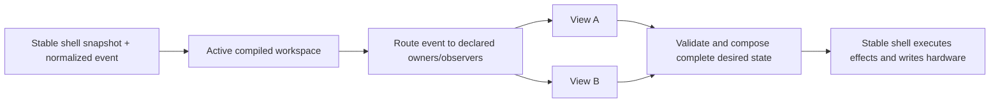

# Views API and Composite Workspaces

Status: design contract. Checkpoints 1 and 2 are structurally implemented through Core API 25. The
remaining stable-adapter boundary is represented explicitly in claims and recorded in
[`../ARCH.md`](../ARCH.md). The checkpoints remain below so code, offline tests, and Push hardware
tests can be compared against the intended end state.

## Goal

Make a controller view a reusable behavior with a fixed, inspectable Push 2 footprint. A workspace
combines views without allowing configuration to remap their behavior onto arbitrary controls.

The important rule is:

> A view decides where its behavior lives. A workspace may include a named facet, omit an optional
> facet, or explicitly replace an overlapping facet, but it cannot wire arbitrary behavior to raw
> hardware.

This keeps authored configurations useful without making them a second controller-programming
language. A bad composition should fail at compile time with both owners and the contested region,
not turn into order-dependent runtime behavior.

## Terms

- **Surface area**: a stable, named physical or rendered part of Push 2.
- **Claim**: one view's declared ownership of an area for input, output, or both.
- **View**: behavior plus a fixed set of required claims and named optional facets.
- **Facet**: a coherent optional part of a view, such as Drum Controller pitch bend. A facet has a
  fixed footprint; it is not a bag of freely assignable callbacks.
- **Workspace**: a named list of view profiles composed for one controller state.
- **Workspace compiler**: validates claims and produces one deterministic input/output owner table.
- **Stable shell**: owns Bitwig objects, MIDI/USB resources, callbacks, and effect execution.
- **Reloadable core**: owns view selection, composition, policy, and replayable desired state.

"Mode" and "view" in the inherited DrivenByMoss framework are implementation details during the
migration. Pull's model uses **view** for a fixed-footprint behavior and **workspace** for the active
composition. Session navigation and mixer controls are orthogonal views; there is no combined
Session/Mix super-view.

## Push 2 Areas

Areas are semantic and bounded. Grid coordinates use `(column, row)` with row 0 at the bottom, the
same orientation as Push 2 MIDI note layout.

```text
ENCODERS[0..7]             turns and touches
DISPLAY.PARAMETERS[0..7]   parameter name, value, and control graphics
DISPLAY.BOTTOM_STRIP[0..7] track/menu labels aligned to the lower soft keys
SOFT_KEYS.UPPER[0..7]      buttons above the display
SOFT_KEYS.LOWER[0..7]      buttons below the display
GRID.UPPER                 columns 0..7, rows 4..7
GRID.LOWER                 columns 0..7, rows 0..3
SCENE_KEYS.UPPER           four side keys aligned to GRID.UPPER
SCENE_KEYS.LOWER           four side keys aligned to GRID.LOWER
NAVIGATION.ARROWS          left, right, up, down
NAVIGATION.PAGE            page left and page right
NAVIGATION.OCTAVE          octave up and octave down
TOUCH_STRIP                touch and pitch/position data plus strip output mode
TRANSPORT.*                named transport controls, claimed individually
GLOBAL_MODIFIERS.*         Shift, Select, Delete, and similar controls
```

Smaller fixed subregions may be added when a real view proves the need. They must be named for a
stable physical footprint, not created ad hoc by a workspace. For example, the current drum-fill
view occupies the twelve pads at columns 4..7 and rows 1..3 inside `GRID.LOWER`.

A claim declares both ownership and its current realization boundary. The Java API uses explicit
kinds equivalent to:

```java
record SurfaceClaim(SurfaceArea area, ClaimKind kind) {}

enum ClaimKind {
    OBSERVE_INPUT,
    EXCLUSIVE_INPUT,
    DIRECT_INPUT,
    STABLE_ADAPTER_INPUT,
    OUTPUT,
    STABLE_ADAPTER_OUTPUT
}
```

Multiple observers may coexist. There is exactly one owning input claim and one output claim for
any atomic area in a compiled workspace. The `STABLE_ADAPTER_*` kinds keep ownership in the view
graph while honestly recording that current shell mechanics still realize it; they require a
declared stable adapter facet. They are frozen migration-debt markers, not implementation choices
for new work. An adapter may preserve existing behavior only; a requested semantic change requires
a reusable canopy expansion and core policy.

A grid input claim includes the pad edge, its strike velocity, and per-pad pressure. Pressure is a
companion event for the same physical pad and follows the same compiled owner; it is never enabled
through a separate concrete-view registration list. A view may ignore pressure, and an unmapped
pad has no musical pressure destination. Aggregate channel pressure has no pad identity and remains
a distinct surface-wide input.

The stable shell captures those events and publishes the current typed pressure configuration and
drum base note. A reloadable view owns the mapping from its fixed playable footprint to MIDI effects.
The stable adapter for a core-owned composite must be inert for pressure, while standalone views
which have not migrated may preserve their existing generic stable view contract unchanged. They
may not acquire new pressure or mapping semantics there.

## Fixed Views

A view exposes named profiles, not arbitrary ports:

```java
interface ControllerView {
    ViewId id();
    ViewProfile profile();
    void start(ControllerSnapshot snapshot);
    void reconcile(ControllerSnapshot snapshot);
    List<CoreEffect> handle(CoreEvent event, ControllerSnapshot snapshot);
    ViewOutput render(ControllerSnapshot snapshot);
}

record ViewProfile(
    ProfileId id,
    Set<SurfaceClaim> requiredClaims,
    Set<ControllerViewFacet> requiredControllerFacets,
    Map<FacetId, ViewFacet> optionalFacets,
    Set<FacetId> enabledFacets
) {}

record ViewFacet(
    FacetId id,
    Set<SurfaceClaim> claims,
    Set<ControllerViewFacet> controllerFacets
) {}
```

The code currently represents IDs as validated strings. The shape above is normative: fixed claims
live with the view, selected facets are part of the profile, and configurations may select only
facets that the view declares.

Examples:

- **Drum Controller** requires `GRID.LOWER`. Its lower half contains the 4x4 playable drum block,
  four momentary rate pads, and twelve fill pads. Its named `pitch-bend` facet claims
  `TOUCH_STRIP`. It does not claim either scene-key group.
- **Session Clip Grid (upper)** requires `GRID.UPPER` and may claim `SCENE_KEYS.UPPER` as its named
  `scene-launch` facet.
- **Project Macro Controls** requires `ENCODERS`, `DISPLAY.PARAMETERS`, and encoder touches. It does
  not implicitly own the lower track strip.
- **Track Selection Strip** requires `DISPLAY.BOTTOM_STRIP` and `SOFT_KEYS.LOWER`.
- **Session Navigation** currently requires `NAVIGATION.ARROWS` and `NAVIGATION.PAGE` because the
  installed stable adapter realizes them together. Page navigation may become optional only after
  the shell exposes it as an independently selectable facet.

## Workspace Compilation

A workspace is intentionally boring data:

```yaml
name: VS Live
session_bank:
  tracks: 8
  scenes: 4
views:
  - use: project-macro-controls
  - use: track-selection-strip
  - use: session-navigation
  - use: session-clip-grid-upper
    facets: [scene-launch]
  - use: drum-controller
    facets: [pitch-bend]
```

The first implementation may construct this exact data in Java. YAML or JSON loading comes only
after the compiler and ownership diagnostics are stable.

`session_bank` is part of the workspace's fixed footprint, not a free mapping. The normal Session
view declares `8x8`; the current upper-grid Session profile declares `8x4`. The stable shell eagerly
installs only the deduplicated bank shapes declared by installed views and adapters. Core selects
among those banks as replayable workspace state, while stable switches the matching Bitwig proxy,
preserves track/scene offsets, and gives only that proxy clip-launcher feedback. A core requesting an
undeclared shape is rejected before activation; adding a new shape requires a shell build and Bitwig
restart, while selecting or composing already installed shapes remains core-reloadable.

Compilation rules:

1. Expand each selected profile and facet into atomic claims.
2. Permit shared `OBSERVE` input claims.
3. Reject overlapping exclusive-input or output claims by default.
4. Permit replacement only through an explicit, named overlay rule that identifies the displaced
   facet and replacement facet.
5. Produce deterministic input and output ownership tables independent of declaration order.
6. Validate required shell capabilities before activation.
7. Validate that the declared Session bank shape matches the fixed Session adapter footprint.

V1 has no dynamic negotiation. V2 may allow a workspace to enable or disable named optional facets
based on capabilities, but a view's remaining footprint still cannot move.

## Runtime Flow



Activation is transactional. The candidate workspace compiles and renders a complete initial
result before it replaces the active workspace. Reload captures the active workspace ID and view
state in the checkpoint envelope. A rejected candidate leaves the prior generation active.

The stable adapter realizes page and grid facets as independent leases. A page overlay such as
Master may replace the encoder/display page while retaining the selected workspace's grid facets;
it must not select a different Bitwig track merely to activate the inherited display mode.
Transitions back to stable layouts are also views, not shell history: plain Session compiles
`TrackMixerPageView` with `FullSessionView`, and Note compiles `TrackMixerPageView` around the
stable preferred-note command. Core holds those destination facets until the authoritative layout
snapshot reports the requested mode/view, then releases them without changing the realized stable
layout. An empty workspace therefore means only "release every core facet"; it does not choose or
restore a destination.

## Implementation Checkpoints

### Checkpoint 1: Behavior-Preserving View Runtime

Introduce the fixed-footprint model and workspace compiler inside the reloadable core. Move the
currently migrated behavior through views:

- Drum-fill matching, launch ownership, and twelve pad lights become one fixed drum-fill view.
- Record, Shift + Record, and Select + Record become one fixed Record control view.
- A default workspace composes those views.
- Existing `CoreResult` output, input routes, bridge subscriptions, clip bindings, effects,
  reload semantics, and hardware behavior remain byte-for-byte or value-for-value equivalent.

Offline tests must retain all current behavior cases and add compiler tests for conflicting output,
exclusive input, shared observers, and declaration-order independence. Commit this checkpoint
before adding `VS Live`; it is the rollback point for the first Bitwig/Push smoke test.

### Checkpoint 2: `VS Live` Composite

Add one hardcoded workspace named `VS Live`, entered with **Shift + Session** for now:

- Project Macro Controls own the eight top encoders, their touches, and parameter display, matching
  the current Project side of User mode.
- Track Selection Strip owns the lower display strip and lower soft keys so visible tracks can be
  selected directly.
- Session Navigation owns the arrow keys (and established Session paging behavior) so track/scene
  navigation remains available.
- Session Clip Grid owns the upper four pad rows. Clip launch behavior and scene order match Session
  view through its declared `8x4` Session bank rather than an `8x8` bank cropped at render time.
- Drum Controller owns the bottom four pad rows, including its existing 4x4 playable block, rate
  pads, and fill pads. Separate fixed views implement those subregions: `DrumControllerView` for
  playable notes and pressure, `DrumRateView` for rate/roll policy, and `DrumFillView` for fills.
- Drum Controller's `pitch-bend` facet owns the touch strip.
- Per-pad pressure on Drum Controller's playable 4x4 block follows that same lower-grid ownership;
  pressure on rate, fill, and Session pads has no musical destination.
- `DrumControllerView` implements that policy with its other lower-grid behavior. It observes the
  playable pad edges and pressure, honors Off/Poly/Channel/CC configuration, and sends mapped output
  through the permanent NoteInput MIDI effect. `WorkspaceView` performs no parallel pressure
  mutation.
- No view claims the lower scene keys merely because they sit beside Drum Controller. Upper scene
  keys may launch the four visible Session scenes through the Session grid's named facet.

The first version is deliberately a Java-defined configuration and a hardcoded entry gesture. It
proves that fixed views compose correctly before configuration parsing or dynamic negotiation is
added.

Plain **Session** exits through an explicit destination workspace containing the Track/Mix page and
the complete `8x8` Session view. **Note** enters a controller-level core view that resolves the
selected track's target-fenced preference and applicability to one bounded installed note view.
Core holds the destination until controller-layout read-back acknowledges the requested stable
mode/view; command submission alone does not release ownership. Stable code must not infer the
view from a pinnable cursor, force the workspace from generic mode/view listeners, or recover a
destination from previous-mode history.

The four rate pads are a complete core-owned semantic slice. Their edge routes and RGB feedback are
exclusive while Drum Controller is engaged, and the output includes a replayable desired
note-repeat state. Stable only reads the installed Repeat engine, applies the bounded request, and
restores the pre-ownership manual state after later read-back. Disabling **Automatic arp / roll**
releases that lease and blanks the rate pads without changing note-view policy.

The stable API addition for this checkpoint is limited to one complete
`DesiredControllerWorkspace`: a name plus a set of known fixed-facet IDs. `VS Live`, its selected
facets, its conflict-free composition, and the Shift + Session selection state live in the
reloadable core. The stable shell contains only reusable adapters for facet mechanics that still
depend on the inherited Bitwig/DrivenByMoss object graph. There must be no stable-shell branch on
the name `VS Live`. As individual grid, parameter, display, and navigation capabilities cross the
core boundary, those adapters can be replaced without changing workspace configuration.

The Bitwig smoke test checks:

1. Existing startup and ordinary Session/Drum/User behavior still work.
2. Shift + Session enters `VS Live` without a stuck Shift gesture.
3. Encoders edit project macros and the display reflects authoritative values.
4. Lower soft keys select the tracks named in the bottom strip.
5. Arrow keys navigate the Session bank.
6. Upper pads launch the expected four scenes; lower pads play drums/rates/fills only.
7. Pitch bend reaches the selected drum track and releases cleanly.
8. Strike velocity and pressure produce the same drum-note behavior as standalone Drum Controller.
9. Plain Session and Note leave the workspace through their ordinary destinations; re-entry
   restores composite ownership and note mapping.
10. Moving from a melodic track to a drum target while Note is visible selects Drum Controller
    after authoritative drum applicability arrives; moving back selects the track's melodic view.
11. Automatic roll is present only while Drum Controller owns the rate pads, its lights follow
    Repeat read-back, and leaving or disabling it retires Repeat while restoring the prior manual
    parameters.

Commit the composite separately so a hardware failure can be bisected to either the view-runtime
migration or the `VS Live` shell integration.

## Deferred Work

- YAML/JSON configuration loading and schema versioning.
- Capability-driven optional-facet negotiation.
- Complete remaining display and light ownership in the stable Core API. Until each surface
  migrates, its inherited stable renderer is frozen and may not receive new semantics.
- Migrating every inherited DrivenByMoss mode/view family.
- User-authored overlays beyond named, statically validated replacements.
- Persisting richer per-view navigation state across reload.
